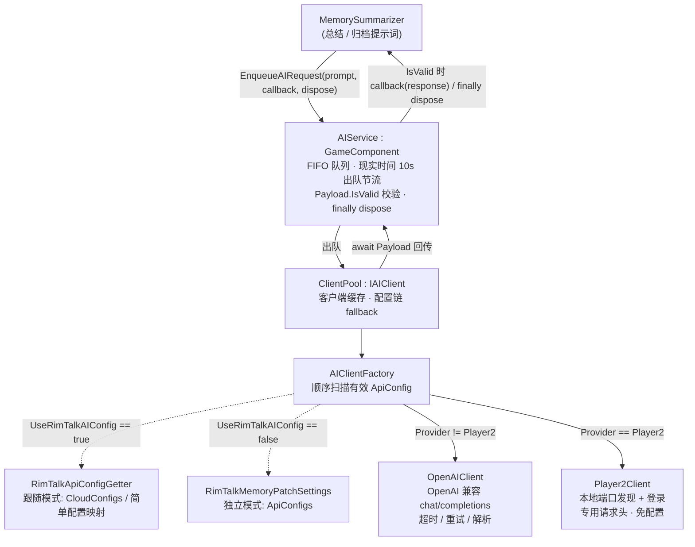

# RimTalk Expand Memory - AI 层架构与运作管线

> 本文描述 v1.10 重写、v1.12 引入 Player2 后的 AI 层当前实现。历史重写方案与结项记录见 `Docs/AI层重写方案.md`；上层调度语境见 `项目管线.md` 与 `Docs/维护层.md`。

AI 层是记忆拓展的长耗时调用基础设施，位于 `Source/AI/`，以 `GameComponent` 级单例 `AIService` 为编排中枢。它对业务方（当前唯一调用方为 `MemorySummarizer`）只暴露一个静态入口 `EnqueueAIRequest(prompt, callback, dispose)`，内部经统一队列节流、客户端池 fallback，最终把结果经 `Payload` 回传业务回调。AI 基础设施本身不引用 `MemoryEntry`，与记忆业务完全解耦。

## 1. 链路总览



职责边界：

- `MemorySummarizer` 负责业务提示词、源条目状态和结果写回。
- `AIService` 负责队列、节流、统一结果检查和回调派发。
- `ClientPool` 负责按配置顺序 fallback 与客户端缓存。
- `AIClientFactory` 负责选择配置并按 provider 创建客户端。
- `OpenAIClient` / `Player2Client` 负责请求构造、网络、超时、重试和响应解析。

## 2. AIService：队列与生命周期

`AIService` 是 `GameComponent`，构造时把自身写入静态 `_instance`。静态门户行为：

| 方法 | 无实例时 | 有实例时 |
|---|---|---|
| `EnqueueAIRequest` | 静默丢弃 | 加入实例队列 |
| `ValidateAIConfigAsync` | 返回 `false` | 验证池中配置 |
| `ResetClientPool` | 无操作 | 清空池并重建工厂 |

队列语义：

- FIFO 队列不持久化、无取消令牌、无去重、无结果缓存。
- `GameComponentUpdate()` 每帧轮询，但只有距上次出队至少 10 秒（现实时间）才启动下一项；限制的是**启动间隔**而非并发数，单次调用超 10 秒时后续请求仍会启动。
- `ExecuteTask` 约定：`Payload` 为空或 `IsValid == false` 时记录错误、不调用业务回调；有效时调用 `callback(Payload.Response)`；无论成功失败或回调抛异常，`finally` 均执行 `dispose`。

## 3. ClientPool：配置链 fallback

- 池在 `AIService` 生命周期内缓存已创建的 `IAIClient`；每个新请求都从池中第 0 个客户端开始，不保存"上次成功配置"。
- 当前客户端返回 `null` 或无效 `Payload` 后，复用或由工厂懒创建下一客户端；任一有效结果即返回。
- 配置耗尽时返回最后一个失败结果；一个客户端都未创建则可能返回 `null`。
- `maxRetries = 100` 是池循环保护，不代表对同一配置发送 100 次请求。
- 任务执行期间池被 `Reset()`（如 UI 修改配置）时，检测到索引越界会从头重新遍历。
- `Reset()` 清空客户端列表并替换工厂，下一次扫描重新从配置链头开始。

## 4. AIClientFactory 与配置来源

配置源二选一（`UseRimTalkAIConfig` 开关决定，**不是两级 fallback**，跟随模式失败后不会自动转入独立配置）：

```text
UseRimTalkAIConfig == true
  -> RimTalkApiConfigGetter.GetRimTalkApiConfigs()
  -> RimTalk 启用简单配置时: SimpleProvider/SimpleApiKey/CurrentModel 映射为单条 ApiConfig (v1.12)
  -> 否则: Settings.Get().CloudConfigs 的深拷贝映射副本

UseRimTalkAIConfig == false
  -> RimTalkMemoryPatchMod.Settings.ApiConfigs
```

工厂持有 `_configIndex`，从上次已产出配置的下一项继续扫描 `apiConfig is { IsEnabled: true, IsValid: true }` 的配置并创建客户端。跟随模式的映射副本在工厂实例内缓存，`Reset()` 重建工厂后才会重新拉取。

按 provider 分流客户端（v1.12）：

```csharp
private IAIClient BuildClient(ApiConfig config) =>
    config.Provider is AIProvider.Player2 ? new Player2Client() : new OpenAIClient(config);
```

## 5. OpenAIClient：OpenAI 兼容端点

- 基于 `UnityWebRequest` POST，请求体为 `{ model, messages, max_tokens }`；`max_tokens` 取 `Settings.SummaryMaxTokens`（默认 8000），配置验证发送 `ping` 且 `max_tokens = 1`。
- 若最终 URL 的 path 恰好为 `/`，自动补成 `/v1/chat/completions`；非根路径保持原样。
- 超时与重试：轮询间隔 100ms；首字节前 120 秒无数据为连接超时；开始接收后 60 秒无新增字节为读取超时；单客户端最多 3 次总尝试（首次 + 4s 后 + 8s 后）；429/5xx/连接超时/读取超时可重试，401/403 与其他致命 4xx 立即失败；网络轮询中发现 `Current.Game == null` 会 Abort。
- 成功判定（`Payload.IsValid == true` 需同时满足）：响应文本非空、可反序列化为 `OpenAIResponse`、`choices` 非空、无显式 `error`；内容取 `choices[0].message.content`，token 数取 `usage.total_tokens`。
- `ValidateAsync()` 不走重试循环，对当前客户端发送一次 ping，失败后由 `ClientPool.ValidateAsync()` 尝试下一配置。

## 6. Player2Client：Player2 本地客户端（v1.12）

Player2 是默认 provider（`ApiConfig.Provider` 默认值、设置界面首次添加的配置均为 Player2）。与 OpenAI 共享 chat completion 的响应结构，但**不需要任何配置**——由 Player2 本地客户端自行完成鉴权，`ApiConfig.IsValid` 对 Player2 恒为 `true`（无需填写 Key、URL、模型）。

连接建立（首次请求时懒执行，结果缓存在客户端实例内）：

1. 读取 `%APPDATA%/game.player2.client/api.port` 获得动态端口，生成候选 base URL（`127.0.0.1` / `localhost` 各一）。
2. 追加默认候选端口 4315 / 4316（各两个 host 变体）。
3. 依次对候选 URL 探测：`GET /health`（2 秒超时）→ `POST /login/web/{GameClientId}`（3 秒超时，空 JSON 体）→ 解析 `Player2LoginResponse.P2Key`。
4. 任一候选成功即缓存 `(P2Key, baseUrl)`，后续请求复用。

请求语义：

- `POST {baseUrl}/chat/completions`，请求头含 `Authorization: Bearer {P2Key}` 与专用 `player2-game-key`；超时 120 秒。
- 请求体 `Player2Request` 只有 `messages` 与可选 `max_tokens`，**不发送 model 字段**（由 Player2 自行选择模型）。
- 响应按 `OpenAIResponse` 解析，成功判定与 OpenAI 相同（额外要求 `choices[0].message.content` 非空）。
- 客户端内部**无重试**：单次 `GetChatCompletionAsync` 只尝试一次 chat 请求（登录探测会遍历候选端口）；失败经 `Payload.ErrorMessage` 上报，由 ClientPool fallback 至下一配置。`ValidateAsync()` 发送 `ping` 并返回 `IsValid`。
- `AIProviderRegistry` 中注册的 Player2 端点 URL 仅为占位，客户端实际不读取配置中的 URL。

## 7. 配置模型

`ApiConfig` 单条可持久化配置：`IsEnabled`、`Provider`、`ApiKey`、`CustomUrl`、`CustomModelName`。`URL` 在 `CustomUrl` 非空时覆盖 Provider 默认端点；`IsValid` 规则：

```text
Provider == Player2 -> 恒 true
否则 -> CustomModelName 非空 且 URL 为合法绝对 URI
```

API Key 可为空，以兼容不要求认证的本地或代理端点。

默认端点注册表（`AIProviderRegistry`）：

| Provider | Endpoint |
|---|---|
| Google | `https://generativelanguage.googleapis.com/v1beta/openai/chat/completions` |
| OpenAI | `https://api.openai.com/v1/chat/completions` |
| DeepSeek | `https://api.deepseek.com/v1/chat/completions` |
| Grok | `https://api.x.ai/v1/chat/completions` |
| GLM | `https://api.z.ai/api/paas/v4/chat/completions` |
| GLMCoding | `https://api.z.ai/api/coding/paas/v4/chat/completions` |
| AlibabaIntl | `https://dashscope-intl.aliyuncs.com/compatible-mode/v1/chat/completions` |
| AlibabaCN | `https://dashscope.aliyuncs.com/compatible-mode/v1/chat/completions` |
| Player2 | `https://api.player2.game/v1/chat/completions`（占位，客户端实际使用本地发现的 base URL） |
| Custom | 无默认端点，必须填写 `CustomUrl` |

设置界面对 Player2 行不显示 Key/URL/Model 输入框，仅提示"Player2 client manages connection automatically"。

## 8. 设置与持久化

| 字段 | Scribe key | 当前用途 |
|---|---|---|
| `EnableAILog` | `EnableAILog` | 记录 URL、模型、请求、响应、token 和错误 |
| `UseRimTalkAIConfig` | `UseRimTalkConfig` | 选择 RimTalk 配置副本或独立配置链 |
| `ApiConfigs` | `ApiConfigs`，`LookMode.Deep` | 独立多配置链（v1.12 起默认 Provider 为 Player2） |
| `SummaryMaxTokens` | `ai_summaryMaxTokens` | chat/completions 的 `max_tokens` |

验证按钮只在存档内显示（依赖 `AIService` 实例）。`RimTalkMemoryPatchMod.WriteSettings()` 对来源开关和独立配置字段计算 hash，变化后调用 `AIService.ResetClientPool()`。注意 hash 不包含 RimTalk 主模组 `CloudConfigs` 内容——跟随模式下仅修改 RimTalk 设置不会主动刷新已缓存的映射副本，需要触发本模组池重置或进入新存档。

## 9. 文件清单

| 路径 | 职责 |
|---|---|
| `Source/AI/AIService.cs` | `GameComponent` 队列、10 秒节流、Payload 检查、回调与清理派发 |
| `Source/AI/AIClientFactory.cs` | 顺序扫描有效配置，按 provider 创建客户端 |
| `Source/AI/AIProvider.cs` | Provider 枚举与默认端点注册表 |
| `Source/AI/ApiConfig.cs` | 单条可持久化配置与 `IsValid` |
| `Source/AI/Payload.cs` | 统一结果载体（`IsValid` 仅显式置 true 才算成功）与日志输出 |
| `Source/AI/Integration/RimTalkApiConfigsGetter.cs` | RimTalk `CloudConfigs`/简单配置到本模组配置的深拷贝映射（provider 枚举经 `Convert` 扩展统一转换） |
| `Source/AI/Client/IAIClient.cs` | 客户端接口：完成请求与验证 |
| `Source/AI/Client/ClientPool.cs` | 客户端缓存、配置 fallback、验证 fallback、Reset |
| `Source/AI/Client/OpenAIClient.cs` | OpenAI 兼容传输：超时、重试、序列化与解析 |
| `Source/AI/Client/Player2Client.cs` | Player2 本地客户端：端口发现、登录、专用请求头 |
| `Source/AI/Client/Dto/OpenAIRequest.cs` / `OpenAIResponse.cs` | OpenAI 兼容请求 / 响应 DTO |
| `Source/AI/Client/Dto/Player2Request.cs` / `Player2LoginResponse.cs` | Player2 请求体（无 model）/ 登录响应 DTO |
| `Source/Settings/SettingsUIDrawers.cs` | 独立配置链表格 UI（Player2 行免输入） |
| `Source/RimTalkSettings.cs` | AI 配置持久化、验证入口、token 设置 |
| `Source/Maintenance/MemorySummarizer.cs` | 当前 AI 层的唯一业务调用方 |

Embedding 边界：`Source/VectorDB/EmbeddingService.cs` 是独立的向量 Embedding 实现，不经过 `AIService`/`ClientPool`/上述 fallback 链；聊天配置与向量配置是两套独立数据源。

## 10. 已知特征与限制

1. `_instance` 无显式出档清理；返回主菜单后静态字段仍指向旧组件，进入新存档由新实例覆盖。
2. `EnqueueAIRequest` 不返回是否入队；异常情况下没有实例时，业务方已设置的"总结中"状态无法经 dispose 恢复。
3. 10 秒只限制出队启动频率，不限制在途并发。
4. 回调通过闭包捕获源条目与目标条目，没有 `pawnId + memoryId + requestId` 失效校验；`AIService` 派发回调前也不检查当前游戏会话是否已切换。
5. 配置重置可与在途池遍历交错；代码会检测越界并重新遍历，但没有显式同步。
6. 除 Player2 外的所有 Provider 均假设支持 OpenAI 兼容协议；Player2 的模型选择权在服务端，无法指定模型。
7. 不迁移 v1.10 重写前删除的旧独立 API 字段；旧用户需启用跟随 RimTalk 或重新填写 `ApiConfigs`。

## 11. 当前结构一句话

> `MemorySummarizer` 把提示词丢进 `AIService` 的 10 秒节流队列，`ClientPool` 经 `AIClientFactory` 沿有效配置链逐个尝试 `OpenAIClient` 或 `Player2Client`，任一有效 `Payload` 回调业务、`finally` 无条件清理——这就是当前 AI 层的全部骨架。
