# RimTalk AI 客户端管线图

本文档描述 RimTalk 主模组中 AI 客户端模块的调用流程、各层职责与数据流转。源码位置:
`D:\Game\Steam\steamapps\common\RimTalk\Source\`。

---

## 一、整体管线流程图

```mermaid
flowchart TD
    %% ========== 入口层 ==========
    subgraph EntryLayer [一、入口层 - 同步线程]
        TS[TalkService.GenerateTalk<br/>生成对话触发入口]
        TSMON[TickManagerPatch / ThoughtPatch<br/>主动触发器]
        USER[用户自定义对话<br/>CustomDialogueService]
    end

    %% ========== 编排层 ==========
    subgraph Orchestrator [二、异步编排队列]
        TREQ[TalkRequest<br/>请求 DTO<br/>Initiator / Recipient / Prompt / PromptMessages]
        BG[Task.Run - 后台线程<br/>GenerateAndProcessTalkAsync]
    end

    %% ========== 服务层 ==========
    subgraph ServiceLayer [三、服务层 AIService]
        CHAT[AIService.ChatStreaming<br/>流式对话]
        QUERY[AIService.Query&lt;T&gt;<br/>一次性查询 - 用于人设生成等]
        BUSY{IsBusy?<br/>忙等保护}
        RETRY[ExecuteWithRetry<br/>统一重试封装]
    end

    %% ========== 错误处理层 ==========
    subgraph ErrorLayer [四、错误处理层 AIErrorHandler]
        HANDLE[AIErrorHandler.HandleWithRetry]
        CANRETRY{CanRetryGeneration?}
        SWITCH[settings.TryNextConfig<br/>切换 Provider/Model]
        QUOTA[QuotaExceededException<br/>配额耗尽警告]
        FAIL[HandleFinalFailure<br/>显示游戏内提示]
    end

    %% ========== 配置工厂层 ==========
    subgraph FactoryLayer [五、配置与工厂层]
        SETTINGS[Settings.Get - .GetActiveConfig]
        APCONFIG[ApiConfig<br/>Provider / ApiKey / SelectedModel / BaseUrl]
        FACTORY[AIClientFactory.GetAIClientAsync]
        REG[AIProviderRegistry.Defs<br/>Provider -> EndpointUrl 字典]
        CACHE_CLI{_instance 缓存<br/>按 Provider 键复用}
    end

    %% ========== 客户端层 ==========
    subgraph ClientLayer [六、客户端层 IAIClient 接口]
        OPENAI[OpenAIClient<br/>处理所有 OpenAI 兼容端点]
        PLAYER2[Player2Client<br/>本地应用 + 远程专用]
    end

    %% ========== 请求构造 ==========
    subgraph BuildLayer [七、请求构造]
        BUILDO[OpenAIClient.BuildRequestJson<br/>DTO 序列化]
        BUILDP[Player2Client.BuildRequestJson]
        DTO[OpenAIRequest / Message<br/>DataContract DTO]
        GEMMA[Gemma-3 special:<br/>system -> user 合并]
        REASON[reasoning_effort<br/>Gemini-Pro=low / Flash=minimal]
        JSONUTIL[JsonUtil.SerializeToJson<br/>DataContractJsonSerializer]
    end

    %% ========== 网络传输 ==========
    subgraph NetLayer [八、网络传输层 UnityWebRequest]
        SENDO[OpenAIClient.SendRequestAsync<br/>统一 POST]
        SENDP[Player2Client.SendRequestAsync]
        HEADERS[Headers:<br/>Authorization: Bearer<br/>Content-Type: application/json<br/>ExtraHeaders / player2-game-key]
        TIMEOUT[智能超时:<br/>连接 本地300s/远程60s<br/>读取 卡顿 60s]
        HEALTH[Player2 后台健康检查<br/>每 60s 一次]
    end

    %% ========== 流式响应处理 ==========
    subgraph StreamLayer [九、流式响应处理 DownloadHandler]
        HANDLERO[OpenAIStreamHandler<br/>SSE 分片解析]
        HANDLERP[Player2StreamHandler]
        BUF[DownloadHandlerBuffer<br/>非流式完整 JSON 缓冲]
        SSE[解析 data: 行<br/>跳过 DONE]
        CHUNK[OpenAIStreamChunk<br/>/ Player2StreamChunk]
        CB1[onContentReceived 回调<br/>逐片输出 content]
    end

    %% ========== 响应解析 ==========
    subgraph ParseLayer [十、响应解析 JsonStreamParser]
        JSP[JsonStreamParser&lt;TalkResponse&gt;<br/>增量大括号匹配解析]
        SANI[JsonUtil.Sanitize<br/>LLM 生成的脏 JSON 清洗<br/>去除 ```json 包裹 / 补全引号 / 修结构]
        DESER[JsonUtil.DeserializeFromJson&lt;T&gt;<br/>DataContractJsonSerializer]
    end

    %% ========== 输出封装 ==========
    subgraph OutputLayer [十一、输出层]
        PAYLOAD[Payload DTO<br/>URL / Model / Request / Response / TokenCount / ErrorMessage]
        TRESP[TalkResponse<br/>Name / Text / InteractionRaw / Target]
        CB2[onPlayerResponseReceived 回调<br/>回传至 TalkService]
    end

    %% ========== 日志统计 ==========
    subgraph LogLayer [十二、日志、历史、统计]
        APIHIST[ApiHistory<br/>每次请求/响应/时延/Token 记录]
        TALKHIST[TalkHistory<br/>对话存储/已说/已忽略]
        STATS[Stats.IncrementCalls<br/>IncrementTokens]
    end

    %% ========== 主流程连线 ==========
    TSMON --> TS
    USER --> TS
    TS --> TREQ
    TREQ --> BG
    BG --> CHAT
    BG --> QUERY

    CHAT --> BUSY
    BUSY -->|否| RETRY
    BUSY -->|是| WAIT[等待/丢弃] --> TS

    RETRY --> HANDLE
    HANDLE -->|首次失败| CANRETRY
    CANRETRY -->|可重试| SWITCH --> HANDLE
    CANRETRY -->|已耗尽| FAIL
    HANDLE -->|成功| FACTORY
    SWITCH --> QUOTA

    FACTORY --> SETTINGS --> APCONFIG
    APCONFIG --> REG
    FACTORY --> CACHE_CLI
    CACHE_CLI -->|未缓存| MAKE[创建实例]
    MAKE --> OPENAI
    MAKE --> PLAYER2
    CACHE_CLI -->|已缓存| OPENAI
    CACHE_CLI -->|已缓存| PLAYER2

    OPENAI --> BUILDO
    PLAYER2 --> BUILDP
    BUILDO --> DTO
    BUILDO --> GEMMA
    BUILDO --> REASON
    BUILDP --> DTO
    DTO --> JSONUTIL
    JSONUTIL --> SENDO
    JSONUTIL --> SENDP
    SENDO --> HEADERS
    SENDP --> HEADERS
    SENDO --> TIMEOUT
    SENDP --> TIMEOUT
    SENDP --> HEALTH

    SENDO --> HANDLERO
    SENDO --> BUF
    SENDP --> HANDLERP
    SENDP --> BUF
    HANDLERO --> SSE
    HANDLERP --> SSE
    SSE --> CHUNK
    CHUNK --> CB1
    CHUNK --> JSP
    BUF --> DESER

    JSP --> SANI
    SANI --> DESER
    DESER --> PAYLOAD
    CB1 --> TRESP
    DESER --> TRESP
    TRESP --> CB2
    PAYLOAD --> CB2

    CB2 --> APIHIST
    CB2 --> TALKHIST
    PAYLOAD --> STATS

    classDef syncLayer fill:#ffe4b5,stroke:#d97706,stroke-width:2px
    classDef asyncLayer fill:#e0f2fe,stroke:#0369a1,stroke-width:2px
    classDef errorLayer fill:#fee2e2,stroke:#b91c1c,stroke-width:2px
    classDef clientLayer fill:#dcfce7,stroke:#15803d,stroke-width:2px
    classDef parseLayer fill:#f3e8ff,stroke:#7e22ce,stroke-width:2px
    classDef outputLayer fill:#fef3c7,stroke:#a16207,stroke-width:2px

    class TS,TSMON,USER,TREQ syncLayer
    class BG,CHAT,QUERY,BUSY,RETRY asyncLayer
    class HANDLE,CANRETRY,SWITCH,QUOTA,FAIL errorLayer
    class OPENAI,PLAYER2,BUILDO,BUILDP,DTO,JSONUTIL,SENDO,SENDP,HANDLERO,HANDLERP,BUF,SSE,CHUNK clientLayer
    class JSP,SANI,DESER parseLayer
    class PAYLOAD,TRESP,CB2,APIHIST,TALKHIST,STATS outputLayer
```



---

## 二、分层职责说明

### 1. 入口层 (同步,游戏主线程)

| 触发源 | 文件 | 说明 |
|---|---|---|
| `TalkService.GenerateTalk` | `Service\TalkService.cs:26` | 主入口。进行前置检查(模组是否启用、AI 是否忙碌、附近 Pawn 数量、是否独白、状态变化去重) |
| `TickManagerPatch` / `ThoughtPatch` | `Patch\*.cs` | 通过 Harmony 钩子在游戏 Tick/事件触发对话 |
| `CustomDialogueService` | `Service\CustomDialogueService.cs` | 玩家手填对话 |

### 2. 异步编排

`Task.Run(() => GenerateAndProcessTalkAsync(talkRequest))` (`TalkService.cs:90`) 将工作切到后台线程,避免阻塞 Unity 主线程。请求以 `TalkRequest` DTO 携带(Pawn 引用、Prompt、上下文、预构建消息列表 `PromptMessages`)。

### 3. 服务层 `AIService` (`Service\AIService.cs:15`)

- **`ChatStreaming`** (`:23`):流式对话,回调 `onPlayerResponseReceived` 每个 Pawn 发言片段逐次触发。
- **`Query<T>`** (`:59`):单次查询(用于 Persona 生成等),将结果反序列化为 `T : IJsonData`。
- **`ExecuteWithRetry`** (`:87`):集中 `_busy` 忙碌标记 + `_firstInstruction` 状态。
- **状态**:`IsBusy()` / `IsFirstInstruction()` 供 UI 判断。

### 4. 错误处理 `AIErrorHandler` (`Error\TalkErrorHandler.cs:9`)

- **`HandleWithRetry`** (`:13`):最多 *1 次* 重试,失败后调用 `CanRetryGeneration` 决定策略:
  - 简单配置模式:启用 fallback model 一次
  - 云端多 Provider 模式:`TryNextConfig` 轮询下一个云端配置
- **`QuotaExceededException`** (`:5`):独立配额耗尽分支,避免重复游戏内弹窗(`_quotaWarningShown`)。
- 失败兜底:`ShowGenerationWarning` → `Messages.Message` 显示游戏内通知。

### 5. 配置与工厂层

| 组件 | 位置 | 职责 |
|---|---|---|
| `Settings.Get().GetActiveConfig()` | `Settings.cs` | 读取 `ApiConfig`(Provider/ApiKey/SelectedModel/CustomModelName/BaseUrl) |
| `AIProviderRegistry.Defs` | `Settings\AIProvider.cs:32` | 静态字典,预置各 Provider 的 `EndpointUrl` / `ListModelsUrl` / `ExtraHeaders` |
| `AIClientFactory.GetAIClientAsync` | `Client\AIClientFactory.cs:19` | 单例缓存 + Provider 变更检测;Player2 需要异步工厂(本地探测) |

**Provider 路由表** (`AIClientFactory.CreateServiceInstanceAsync` `:40`):

| AIProvider | 渲染为 | 端点 (来自 Registry) |
|---|---|---|
| `Player2` | `Player2Client.CreateAsync` | `https://api.player2.game` (本地 `localhost:4315` 优先) |
| `Local` | `OpenAIClient(BaseUrl, CustomModelName)` | 用户自定义 |
| `Custom` | `OpenAIClient(BaseUrl, CustomModelName, ApiKey)` | 用户自定义 |
| `Google` | `OpenAIClient` | `https://generativelanguage.googleapis.com/v1beta/openai/chat/completions` ⚠ 走 OpenAI 兼容端点 |
| `OpenAI` / `DeepSeek` / `Grok` / `GLM` / `GLMCoding` / `OpenRouter` / `AlibabaIntl` / `AlibabaCN` | `OpenAIClient` | 各自 `EndpointUrl` + 可选 `ExtraHeaders` |

### 6. 客户端层 `IAIClient` (`Client\IAIClient.cs:8`)

**接口统一**:
- `GetChatCompletionAsync(prefixMessages, messages, onRequestPrepared)` → `Payload` (非流式)
- `GetStreamingChatCompletionAsync<T>(...)` → `Payload` (流式 + 回调)

#### 6.1 `OpenAIClient` (`Client\OpenAI\OpenAIClient.cs:15`)

**主构造** (primary constructor):`baseUrl, model, apiKey, extraHeaders`

**URL 规整** (`:26`):`FormatEndpointUrl` 自动补全缺省路径 `/v1/chat/completions`。

**请求构造** `BuildRequestJson` (`:73`):
1. 合并 `prefixMessages + messages`,相邻同角色用 `\n\n` 拼接
2. **Gemma-3 特例** (`:82`):把所有 system 消息合并成一个 user(前缀随机数),因 Gemma-3 不支持 system
3. **reasoning_effort 注入** (`:118`):
   - `gemini-pro` → `"low"`
   - `gemini-flash` / `gemma-4` → `"minimal"`
4. `JsonUtil.SerializeToJson(new OpenAIRequest{...})` (DataContract 序列化)

**网络** `SendRequestAsync` (`:150`):基于 `UnityWebRequest`(`UploadHandlerRaw` + 自定义 `downloadHandler`)
- 智能判断是否本地端点(localhost/127/0.0.1/192.168/10)→ 连接超时 300s 否则 60s
- 读取超时 60s:监控 `downloadedBytes`,无增长累计达阈值即 `webRequest.Abort()`
- `Current.Game == null` (游戏退出)立即返回 `null`
- 429 / `webRequest.responseCode >= 400` → `ErrorUtil.ExtractErrorMessage` → 抛 `QuotaExceededException` / `AIRequestException`

**响应反序列化**:
- 非流式:直接 `JsonUtil.DeserializeFromJson<OpenAIResponse>`,取 `Choices[0].Message.Content` + `Usage.TotalTokens`
- 流式:走 `OpenAIStreamHandler`

#### 6.2 `Player2Client` (`Client\Player2\Player2Client.cs:15`)

**异步工厂** `CreateAsync(fallbackApiKey)` (`:40`):
1. `TryGetLocalPlayer2Key` (`:238`):先 `GET localhost:4315/v1/health`(timeout 2s),通过则 `POST /v1/login/web/{GameClientId}` 拿 `p2Key`
2. 本地成功 → `new Player2Client(localKey, isLocal: true)`
3. 否则使用用户的 `fallbackApiKey` 作为云端
4. 双失败 → 抛异常

**后台健康检查** (`:322`):远程连接每 60s 触发 `EnsureHealthCheck(force=true)`,`while(_healthCheckActive && Current.Game != null)` 循环。

**请求特殊头**:`Authorization: Bearer {_apiKey}` + `player2-game-key: 019a8368-...`(GameClientId)。

**错误分支** (`:209`):`ResourceExhausted` / `Insufficient` → `QuotaExceededException`。

### 7. 流式响应处理

#### 7.1 `OpenAIStreamHandler` (`Client\OpenAI\OpenAIStreamHandler.cs:11`)

继承 `DownloadHandlerScript`,在 `ReceiveData` 中:
- 维护三个 `StringBuilder`:`_buffer`(残余行)/ `_fullText`(累积内容)/ `_allReceivedData`(原始字节)
- 按 `\n` 切行 → 行尾不带 `\n` 视为不完整 → 回退到 `_buffer`
- 每行 `data: ` 前缀剥离 → `[DONE]` 跳过 → `JsonUtil.DeserializeFromJson<OpenAIStreamChunk>`
- 命中 `Delta.Content` → `onContentReceived(content)` 增量回调 + 累积到 `_fullText`
- 抓取 `FinishReason` / `Usage`
- 检测到 `Error` → 置 `DetectedError`,`SendRequestAsync` 后续抛 `AIRequestException`
- `GetRawJson()`:把累积片段重新拼成完整 `OpenAIResponse` 结构供日志

#### 7.2 `Player2StreamHandler` (`Client\Player2\Player2StreamHandler.cs:8`)

类似但需要 `Flush()` 在结束时补处理最后半行(Player2 协议差异)。

### 8. 增量 JSON 解析 `JsonStreamParser<T>` (`Util\JsonStreamParser.cs:6`)

针对 SSE 包含的多个 JSON 对象(例如一次对话多 Pawn 发言串行返回),维护 `_buffer` 状态机:
- `IndexOf('{')` 起步,`FindMatchingBrace` 手工匹配大括号(规避 LLM 输出的中文引号 `" "` 问题)
- 对每个完整 JSON 子串 `JsonUtil.TryDeserializeFromJson<T>`
- 已消费部分从缓冲移除,保留不完整尾部
- 容错:`JsonUtil.IsJsonQuote` / `IsLikelyStringTerminator` / `IsClosingQuoteForActiveString` 处理 Unicode 弯引号

### 9. JSON 清洗 `JsonUtil.Sanitize` (`Util\JsonUtil.cs:65`)

LLM 常输出不合法 JSON,清洗管线:
1. 去除 ` ```json ` / ` ``` ` 包裹
2. 截取第一个 `{`/`[` 到最后一个 `}`/`]`
3. `"key":,` / `"key":}` → 补 `null`(`:88`)
4. `][` → `,`,`}{` → `},{`
5. `{ [...] }` 裹挟数组 → 解出数组
6. `ProtectMalformedQuotes` 状态机修复弯引号/缺引号(逐字符遍历,判断字符串终止符语境)
7. 期望枚举但拿到单个对象 → `[ {obj} ]` 包裹

### 10. 输出封装

- **`Payload`** (`Client\Payload.cs:3`,主构造):`URL / Model / Request / Response / TokenCount / ErrorMessage`,有友好 `ToString()` 输出日志报表
- **`TalkResponse`** (`Data\Json\TalkResponse.cs:10`):`Name / Text / InteractionRaw / Target` 多字段,通过 `IJsonData` 接口
- 通过 callback 回流到 `TalkService.GenerateAndProcessTalkAsync` (`TalkService.cs:110`) 内的 `talkResponse =>` 闭包,挂载 `ParentTalkId` 链接上下文,推入 `PawnState.TalkResponses` 队列等待 `DisplayTalk` 在 Tick 上逐条显示。

### 11. 历史/日志/统计

| 模块 | 作用 |
|---|---|
| `ApiHistory` (`Data\ApiHistory.cs`) | 每次 Request(含 payload)与 Response(含 elapsedMs / token)成对记录,关联 `talkResponse.Id`,供 Debug 窗口展示 |
| `TalkHistory` (`Data\TalkHistory.cs`) | 对话按 Pawn 存档,支持 ignore/spoken 标记 |
| `Stats` (`Data\Stats.cs`) | `IncrementCalls` / `IncrementTokens` 全局统计 |

---

## 三、关键数据流转(单次流式对话俯瞰)

```
[同步线程]
  Pawn 事件 / 用户输入
        │
        ▼
  TalkService.GenerateTalk
       (前置 validation)
        │
        │ 构造 TalkRequest,PromptManager 预渲染 PromptMessages
        ▼
  Task.Run ──► GenerateAndProcessTalkAsync  [后台线程]
        │
        ▼
  AIService.ChatStreaming
        │
        ├─► ApiHistory.AddRequest(Channel.Stream)
        │
        ▼
  ExecuteWithRetry ──► AIErrorHandler.HandleWithRetry
        │                          │
        │                          │ (失败重试 / Provider 切换)
        ▼                          ▼
  AIClientFactory.GetAIClientAsync
        │
        ├─► Settings.Get().GetActiveConfig()
        ├─► AIProviderRegistry.Defs[provider]
        │
        ▼
  ┌─── 分支 ───┐
  │             │
OpenAIClient  Player2Client
  │             │
  │ BuildRequestJson (DTO + JsonUtil.SerializeToJson)
  │             │
  ▼             ▼
  UnityWebRequest (POST, Bearer/游戏键)
  │             │
  │ Sync: DownloadHandlerBuffer  → 整体 JSON 反序列化
  │ Stream: StreamHandler        → SSE 增量回调
  │             │
  ▼             ▼
  JsonStreamParser<TalkResponse>  (含 JsonUtil.Sanitize 清洗)
        │
        ├─► 每个 TalkResponse,TalkService 回调:
        │     ├─ PawnState.TalkResponses.Enqueue
        │     └─ ApiHistory.AddResponse
        │
        ▼
  Payload (URL/Model/Request/Response/Tokens/Error)
        │
        ├─► ApiHistory.UpdatePayload
        ├─► Stats.Increment
        └─► HandleFinalStatus (标错误 / 反序列化失败兜底)

[Tick 线程上]
  TalkService.DisplayTalk → 队列首条 → CreateInteraction
  → PlayLogEntry_RimTalkInteraction → 屏幕气泡显示
```

---

## 四、涉及的文件夹结构速查

```
Source/
├── Service/                服务层 (AIService 编排)
│   ├── AIService.cs        ✦ 核心
│   └── TalkService.cs      ✦ 入口
├── Client/                 AI 客户端层
│   ├── IAIClient.cs        ✦ 接口
│   ├── AIClientFactory.cs  ✦ 工厂
│   ├── Payload.cs          封装 DTO
│   ├── OpenAI/
│   │   ├── OpenAIClient.cs      ✦ 通用兼容客户端
│   │   ├── OpenAIDto.cs         请求/响应 DTO
│   │   └── OpenAIStreamHandler.cs  SSE 流式处理器
│   └── Player2/
│       ├── Player2Client.cs     ✦ Player2 专用
│       ├── Player2Models.cs     DTO
│       └── Player2StreamHandler.cs  SSE 流式处理器
├── Error/                  异常体系
│   ├── AIErrorHandler.cs   ✦ 重试策略
│   ├── AIRequestException.cs
│   └── QuotaExceededException.cs
├── Util/                   工具
│   ├── JsonUtil.cs         ✦ 序列化 + LLM 脏 JSON 清洗
│   ├── JsonStreamParser.cs ✦ 流式增量解析
│   └── ErrorUtil.cs        错误信息提取
├── Settings/
│   ├── AIProvider.cs       ✦ Provider 枚举 + Registry
│   ├── ApiConfig.cs        ✦ 单条 API 配置持久化
│   └── Settings_Api.cs    配置 UI/逻辑切片
├── Data/
│   ├── TalkRequest.cs      ✦ 请求 DTO
│   ├── Json/TalkResponse.cs ✦ 响应 DTO
│   ├── Channel.cs          Stream / Query / User 通道枚举
│   ├── Role.cs             System / User / AI 角色枚举
│   ├── ApiHistory.cs       API 调用历史
│   ├── TalkHistory.cs      对话历史
│   └── Stats.cs            调用/Token 统计
└── Patch/                  Harmony 钩子(触发 TalkService)
    ├── TickManagerPatch.cs
    ├── ThoughtPatch.cs
    └── ...
```

图例:✦ = 与 AI 客户端管线直接相关的核心文件。

---

## 五、主要可扩展点

| 扩展场景 | 入口 |
|---|---|
| 新增 OpenAI 兼容 Provider | `AIProvider` 枚举 + `AIProviderRegistry.Defs` |
| 完全独立的非兼容协议 | 新建 `XxxClient : IAIClient` + `AIClientFactory.CreateServiceInstanceAsync` 内加 case |
| 自定义 SSE 协议 | 新建 `XxxStreamHandler : DownloadHandlerScript` |
| 自定义错误重试策略 | 重写 `AIErrorHandler.CanRetryGeneration` / `HandleFinalFailure` |
| 自定义请求字段(如工具调用) | 在 `OpenAIDto.cs` 添加 `DataMember`,`BuildRequestJson` 注入 |

---

*本文件由源码分析自动整理,基于 RimTalk 当前已编译源码。源码路径外部于当前工作区,所有引用相对路径以 RimTalk 模组根为准。*