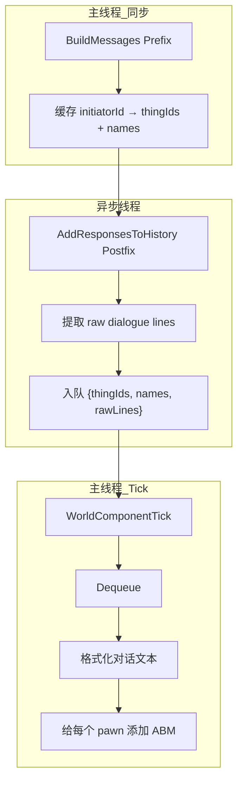

# 记忆系统重构设计 - 最终版 v5

## 1. 目标

1. **删除 SCM 逐条记录**：不再在每条消息产生时创建 SCM
2. **ABM 记录完整对话**：一轮对话作为一个整体存入 ABM
3. **所有参与者获得记忆**：包括在场但未说话的 pawn
4. **精确检测对话完成**：在 AI 流式传输完成的确切时刻处理

## 2. RimTalk TalkHistory 分析

### 异步处理方式

RimTalk 的 `TalkHistory` 确实在异步线程中直接处理：

```csharp
// TalkHistory.cs:37-46
public static void AddMessageHistory(Pawn pawn, string request, string response)
{
    // 使用 ConcurrentDictionary + lock 双重保护
    var messages = MessageHistory.GetOrAdd(pawn.thingIDNumber, _ => []);
    lock (messages)
    {
        messages.Add((Role.User, request));
        messages.Add((Role.AI, response));
    }
}
```

**它可以这样做的原因**：
- 只访问 `pawn.thingIDNumber`（int 值，不可变）
- 只操作自己的静态集合（ConcurrentDictionary）

**我们不能直接这样做的原因**：
- 需要访问 `FourLayerMemoryComp`（Unity/RimWorld 组件，需要主线程）
- 需要调用 `AddActiveMemory`（可能触发 UI 更新等主线程操作）

**结论**：保持队列模式，异步入队，主线程处理。

## 3. 核心设计

### 数据流



### 对话存储格式

```
[对话参与者：张三、李四、王五]
张三: "你好，今天天气真好。"
李四: "是啊，适合出去打猎。"
```

**说明**：王五虽然没说话，但他在场，所以出现在参与者列表中。

## 4. 数据结构

### DialogueLine（对话行）

```csharp
/// <summary>
/// 单条对话记录（异步线程提取，不可变）
/// </summary>
public readonly struct DialogueLine
{
    public readonly string SpeakerName;
    public readonly string Text;
    
    public DialogueLine(string speakerName, string text)
    {
        SpeakerName = speakerName;
        Text = text;
    }
}
```

### PendingConversation（待处理对话）

```csharp
/// <summary>
/// 待处理的对话记录
/// </summary>
public class PendingConversation
{
    /// <summary>
    /// 所有参与者的 ThingID（用于查找 Pawn）
    /// </summary>
    public List<string> ParticipantThingIds { get; set; }
    
    /// <summary>
    /// 所有参与者的名字（主线程缓存，用于格式化）
    /// </summary>
    public List<string> ParticipantNames { get; set; }
    
    /// <summary>
    /// 原始对话行（异步线程提取）
    /// </summary>
    public List<DialogueLine> RawDialogue { get; set; }
    
    /// <summary>
    /// 对话发生的游戏 Tick
    /// </summary>
    public int Timestamp { get; set; }
}
```

## 5. Hook 实现

### 5.1 Hook 1: 捕获参与者（主线程）

**文件**: `Source/Patches/Patch_PromptManagerBuildMessages.cs`

```csharp
[HarmonyPatch]
public static class Patch_PromptManagerBuildMessages
{
    /// <summary>
    /// 缓存的参与者信息
    /// </summary>
    public class CachedParticipants
    {
        public List<string> ThingIds { get; set; }
        public List<string> Names { get; set; }
    }
    
    /// <summary>
    /// 参与者缓存 (线程安全)
    /// Key: initiator.ThingID
    /// </summary>
    public static readonly ConcurrentDictionary<string, CachedParticipants> Cache = new();
    
    [HarmonyPrefix]
    public static void Prefix(object talkRequest, List<Pawn> pawns, string status)
    {
        var initiator = GetInitiator(talkRequest);
        if (initiator == null || pawns == null) return;
        
        // 在主线程中提取所有信息
        var cached = new CachedParticipants
        {
            ThingIds = pawns.Select(p => p.ThingID).ToList(),
            Names = pawns.Select(p => p.LabelShort).ToList()
        };
        
        Cache[initiator.ThingID] = cached;
    }
}
```

### 5.2 Hook 2: 捕获对话（异步）

**文件**: `Source/Patches/Patch_AddResponsesToHistory.cs`

```csharp
[HarmonyPatch]
public static class Patch_AddResponsesToHistory
{
    public static readonly ConcurrentQueue<PendingConversation> Queue = new();
    
    [HarmonyPostfix]
    public static void Postfix(object responses, string prompt)
    {
        // 1. 提取原始对话行（异步安全，只读取值类型/字符串）
        var rawLines = ExtractDialogueLines(responses);
        if (rawLines.Count == 0) return;
        
        // 2. 从第一个说话者反推 initiator
        string initiatorId = GetInitiatorId(rawLines[0].SpeakerName);
        if (initiatorId == null) return;
        
        // 3. 获取缓存的参与者信息
        if (!Patch_PromptManagerBuildMessages.Cache.TryRemove(initiatorId, out var cached))
            return;
        
        // 4. 入队（主线程会处理格式化）
        Queue.Enqueue(new PendingConversation
        {
            ParticipantThingIds = cached.ThingIds,
            ParticipantNames = cached.Names,
            RawDialogue = rawLines,
            Timestamp = GetCurrentTick()
        });
    }
    
    private static List<DialogueLine> ExtractDialogueLines(object responses)
    {
        var lines = new List<DialogueLine>();
        var list = responses as IList;
        if (list == null) return lines;
        
        foreach (var response in list)
        {
            var type = response.GetType();
            var name = type.GetProperty("Name")?.GetValue(response) as string;
            var text = type.GetProperty("Text")?.GetValue(response) as string;
            
            if (!string.IsNullOrEmpty(text))
            {
                lines.Add(new DialogueLine(name ?? "???", text));
            }
        }
        
        return lines;
    }
}
```

### 5.3 主线程处理（格式化 + 存储）

**文件**: `Source/Memory/MemoryManager.cs`

```csharp
private void ProcessConversationQueue()
{
    while (Patch_AddResponsesToHistory.Queue.TryDequeue(out var record))
    {
        // 在主线程格式化对话文本
        string formattedText = FormatConversation(record);
        
        // 查找所有参与者的 Pawn
        var pawns = FindPawnsByThingIds(record.ParticipantThingIds);
        
        // 给每个参与者添加 ABM
        foreach (var pawn in pawns)
        {
            var comp = pawn.TryGetComp<FourLayerMemoryComp>();
            comp?.AddActiveMemory(
                formattedText,
                MemoryType.Conversation,
                importance: 0.6f
            );
        }
    }
}

private string FormatConversation(PendingConversation record)
{
    var sb = new StringBuilder();
    
    // 第一行：参与者列表
    sb.AppendLine($"[对话参与者：{string.Join("、", record.ParticipantNames)}]");
    
    // 对话内容
    foreach (var line in record.RawDialogue)
    {
        sb.AppendLine($"{line.SpeakerName}: \"{line.Text}\"");
    }
    
    return sb.ToString().TrimEnd();
}
```

## 6. 实施清单

### Phase 1: 创建数据结构
- [ ] 创建 `Source/Memory/PendingConversation.cs`（包含 DialogueLine）

### Phase 2: 实现 Hooks
- [ ] 创建 `Source/Patches/Patch_PromptManagerBuildMessages.cs`
- [ ] 创建 `Source/Patches/Patch_AddResponsesToHistory.cs`

### Phase 3: 集成主线程处理
- [ ] 修改 `Source/Memory/MemoryManager.cs` 添加队列处理

### Phase 4: 清理旧代码
- [ ] 禁用 `Source/Patches/RimTalkConversationCapturePatch.cs` 中的逐条记录逻辑

### Phase 5: 测试
- [ ] 测试单人独白
- [ ] 测试双人对话
- [ ] 测试多人对话（3+人）
- [ ] 验证未说话参与者也能获得记忆

## 7. 文件清单

| 文件 | 操作 | 说明 |
|------|------|------|
| `Source/Memory/PendingConversation.cs` | 新建 | 数据结构 |
| `Source/Patches/Patch_PromptManagerBuildMessages.cs` | 新建 | Hook: 缓存参与者 |
| `Source/Patches/Patch_AddResponsesToHistory.cs` | 新建 | Hook: 提取对话并入队 |
| `Source/Memory/MemoryManager.cs` | 修改 | 添加队列处理和格式化 |
| `Source/Patches/RimTalkConversationCapturePatch.cs` | 修改 | 禁用旧逻辑 |

## 8. 方案优势

| 特性 | 说明 |
|------|------|
| **精确检测** | 在 AI 流式传输完成的确切时刻触发 |
| **主线程格式化** | 格式化在主线程完成，可以安全访问所有数据 |
| **线程安全** | 异步只提取不可变数据，主线程处理 Pawn 组件 |
| **完整覆盖** | 所有参与者（包括未说话的）都能获得记忆 |
| **格式直观** | 包含参与者列表，方便理解对话上下文 |