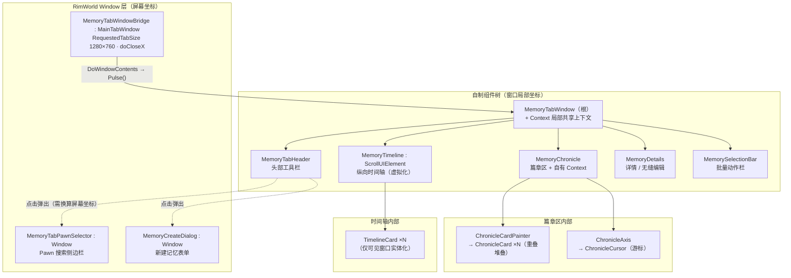

# RimTalk Expand Memory - UI 层：记忆档案工作台

> 本文描述 v1.13 重写后的记忆主标签现状。自制组件框架的抽象细节与开发规范见 `UI层基础设施和规范.md`；总体架构语境见 `项目管线.md`。

## 1. 背景与动机

旧记忆主标签是 `MainTabWindow_Memory` 的九个 partial 文件：单类数千行、布局/交互/数据混杂、局部状态散落各处。v1.13 将其整体重写为自制组件树：

- **组件化**：每个可视区域是一个继承 `UIElement` 的独立类，只负责自己的布局、绘制与交互。
- **上下文化**：跨组件共享状态收敛到 `UIContext` 级联作用域，跨组件通信用事件解耦。
- **桥接最小化**：只有一个真正的 RimWorld `Window`（`MemoryTabWindowBridge`），它把 IMGUI 事件流转发给组件树，自身不含业务。

所有绘制基于 IMGUI（`Widgets`/`GUI`）原语，框架只做生命周期与布局的组织，不引入第三方 UI 系统。

## 2. 总体架构



一次 UI 脉动（Pulse）的执行顺序：

```text
Bridge.DoWindowContents(rect)          ← 每次 OnGUI 事件进入一次
  ├─ Context.Pulse()                    ← Layout 事件时执行 Update：轮询刷新全量缓存
  ├─ base.Pulse()                       ← 根组件自身：Layout 时 Update（如动作栏显隐）→ 每事件 Draw
  ├─ MemoryTabHeader.Pulse()
  ├─ MemoryChronicle.Pulse()            ← 内部再依次 context → CardPainter → Axis
  ├─ MemoryTimeline.ScrollPulse()       ← BeginScrollView → Pulse → EndScrollView
  ├─ MemoryDetails.Pulse()
  └─ MemorySelectionBar.Pulse()
```

## 3. 数据中枢：MemoryTabWindow.Context

根组件的嵌套 `Context` 是整个工作台的共享状态与事件总线：

| 成员 | 语义 |
|---|---|
| `MemoryComp` | 当前展示的 `FourLayerMemoryComp`，随 `Find.Selector` 单选 Pawn 自动切换（`CheckCompChange`） |
| `LifeStartTick` / `LifeCurrentTick` | 全量记忆时间跨度缓存，每帧刷新 |
| `CursorTick` | 核心锚点（时间轴与篇章光标的联动枢纽），setter 自动收束到生命周期范围内 |
| `InRect` | 主窗口内容矩形，**只承载尺寸，恒为零基** |
| `LayerFilter` / `TypeFilter` | 层级 / 类型过滤（单选，null 为全部） |
| `Focuse` | 当前焦点记忆；经 `SetFocuse()` 修改，变化时广播 `FocuseChanged` |
| `Selection` | 选中记忆集合（Ctrl 多选 / Shift 范围选 / 篇章区框选） |
| `TreatedTimelineMemories` | 过滤 + 按时间降序排序后的时间轴记忆缓存 |
| `_allMemories` | 全量记忆哈希缓存，用于每帧校验 `Focuse`/`Selection` 有效性 |

事件（订阅方在构造函数订阅）：

| 事件 | 触发方 | 订阅方 |
|---|---|---|
| `MemoryCompReseted` | Context（切换 Pawn） | Timeline / ChronicleCardPainter（清卡片缓存） |
| `RePositionTimeline` | ChronicleCursor（拖拽游标） | Timeline（滚动定位到锚点卡片） |
| `RePositionCursor` | Timeline（滚轮滚动） | ChronicleCursor（篇章光标移入视野） |
| `FocuseChanged` | `SetFocuse` | MemoryDetails（重置滚动与编辑态） |

注意 `SetFocuse` 先广播再赋值——订阅者拿到的 `Focuse` 仍是旧值。

## 4. 子组件职责

| 组件 | 职责要点 |
|---|---|
| `MemoryTabWindowBridge` | 唯一 RimWorld Window；`SetInitialSizeAndPosition` 时同步 `UpdateRect(InRect)`，`DoWindowContents` 转发 `Pulse`，`PostClose` 传播关闭 |
| `MemoryTabHeader` | Pawn 选择按钮、层级/类型过滤、四层计数统计、工具菜单（常识库/新建/预览/提示词/导入导出/全局总结/指南） |
| `MemoryChronicle` | CLPA 横向篇章导航；自建 `Context` 持 `ChronicleStartTick`/`ChronicleEndTick`（setter 双向收束，最小跨度 2 天） |
| `ChronicleCardPainter` | 每帧从 CLPA 重建可见篇章、重叠深度计算、框选、滚轮平移 |
| `ChronicleAxis` | 刻度线与日期标签（纯绘制结果按 `(rect, startTick, endTick)` 缓存）、滚轮缩放（游标位置锚定） |
| `ChronicleCursor` | 三角游标绘制（`CropBlock` 截断越界部分）与拖拽联动 `CursorTick` |
| `MemoryTimeline` | 纵向时间轴虚拟化列表、绝对布局数组 `_yLayout`、锚定补偿滚动、年/象分隔与长间隔虚线标注 |
| `MemoryCard`（基类） | 层级配色、透明度随 `Activity`、Pin 圆环按钮、总结中/选中脉冲边框、点击选中 |
| `TimelineCard` | 固定高度按类型推算（`HeightOf`）；Ctrl 多选、Shift 范围选 |
| `ChronicleCard` | 深度堆叠（`GUI.depth`），重叠提升控件 |
| `MemoryDetails` | 详情展示与编辑双态无缝切换；编辑草稿独立，保存才回写；编辑态持续暂停游戏 |
| `MemorySelectionBar` | 选中集合 >0 时显示；总结/归档/删除/清空，按选中层级启停按钮 |

数据读写路径：读经 Context 每帧轮询 `MemoryComp` 四层列表（无需手动刷新）；写一律收口于 `MemoryComp.Interactor`（Pin/删除/新增）、`MemoryComp.Summarizer`（总结/归档）与 `CustomScribe`（组件级导入导出），详见 `UI层基础设施和规范.md` 第 5 节。

## 5. 外部集成

- **主标签保活**：Harmony 补丁 `MainTabsRoot_HandleLowPriorityShortcuts_Patch` 短路原版"点击地图关闭非 Inspect 主标签"的左键分支，使玩家在主标签打开时点击地图选人，窗口保持打开并自动切换记忆所有者——这是工作台"点选即切换"交互的前提。
- **弹窗坐标换算**：`MemoryTabHeader` 弹出 `MemoryTabPawnSelector` 时以 `Find.WindowStack.currentlyDrawnWindow.windowRect + Window.StandardMargin` 把局部坐标换算为屏幕坐标（换算规范见 `UI层基础设施和规范.md` 第 3 节）。
- **设置持久化**：时间轴宽度经 `RimTalkMemoryPatchMod.Settings.MemoryTabTimeLineWidth` 随存档持久化，拖拽分隔条时实时写入并于松开时 `Write()`。

## 6. 文件清单

| 路径 | 角色 |
|---|---|
| `Source/UI/UIElement.cs` | 组件树基础元素（脉动 / 布局 / 生命周期） |
| `Source/UI/UIContext.cs` | 级联作用域上下文 |
| `Source/UI/ScrollUIElement.cs` | 滚动视口元素 |
| `Source/UI/TabWindow/MemoryTabWindowBridge.cs` | RimWorld Window 桥接层 |
| `Source/UI/TabWindow/MemoryTabWindow.cs` | 组件树根 + Context 数据中枢 |
| `Source/UI/TabWindow/MemoryCard.cs` | 卡片基类 |
| `Source/UI/TabWindow/MemoryDetails.cs` | 详情 / 编辑区 |
| `Source/UI/TabWindow/MemorySelectionBar.cs` | 批量动作栏 |
| `Source/UI/TabWindow/TabHeader/MemoryTabHeader.cs` | 头部工具栏 |
| `Source/UI/TabWindow/TabHeader/MemoryTabPawnSelector.cs` | Pawn 搜索选择器（屏幕坐标侧边栏） |
| `Source/UI/TabWindow/TabHeader/MemoryCreateDialog.cs` | 新建记忆表单 |
| `Source/UI/TabWindow/Chronicle/MemoryChronicle.cs` | 篇章区（含自有 Context） |
| `Source/UI/TabWindow/Chronicle/ChronicleCardPainter.cs` | 篇章卡片绘制 / 框选 / 平移 |
| `Source/UI/TabWindow/Chronicle/ChronicleCard.cs` | 篇章卡片（深度堆叠） |
| `Source/UI/TabWindow/Chronicle/ChronicleAxis.cs` | 篇章时间轴（刻度缓存 / 缩放） |
| `Source/UI/TabWindow/Chronicle/ChronicleCursor.cs` | 篇章游标（拖拽联动） |
| `Source/UI/TabWindow/Timeline/MemoryTimeline.cs` | 纵向时间轴（虚拟化列表） |
| `Source/UI/TabWindow/Timeline/TimelineCard.cs` | 时间轴卡片 |
| `Source/Utils/GUIBlock.cs` / `CropBlock.cs` / `WidgetsUtil.cs` / `MathUtil.cs` / `TextUtil.cs` / `EnumUtil.cs` / `DictionaryExtensions.cs` | UI 支撑工具 |
| `Source/Patches/UI/MainTabsRoot_HandleLowPriorityShortcuts_Patch.cs` | 地图选人保持主标签打开 |

## 7. 当前结构一句话

> `MemoryTabWindowBridge` 把 IMGUI 事件流转发给 `MemoryTabWindow` 组件树，`Context` 每 Layout 事件轮询 `FourLayerMemoryComp` 刷新共享状态并广播事件，五个子区域（头部 / 篇章 / 时间轴 / 详情 / 动作栏）各自脉动、经 `UIContext` 父链取数、经 `MemoryInteractor` 写回——这就是记忆档案工作台的全部骨架。
