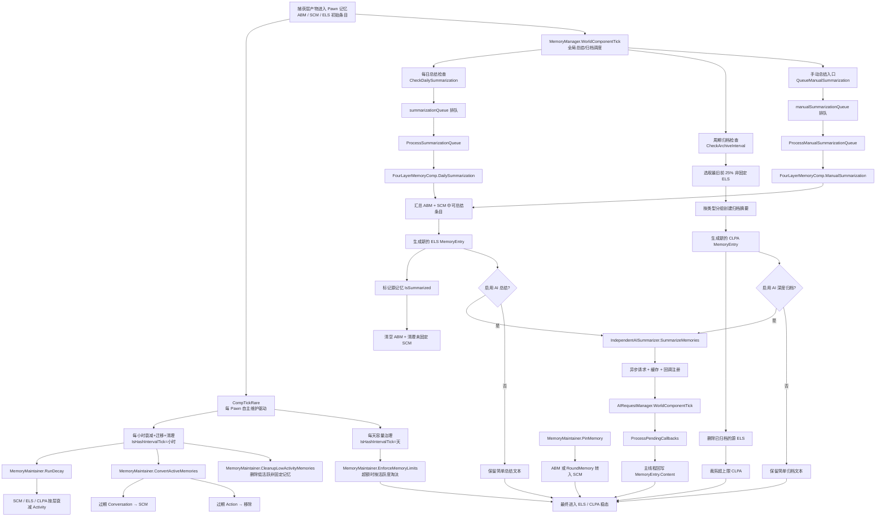

# RimTalk Expand Memory - 维护层结构整理

这份文档只整理当前项目里负责“维护/管理”的那一层，不复述完整采集链和注入链。

这里的“维护层”主要指：

- 记忆活跃度衰减与清理
- 记忆在不同层之间的转移
- 每日总结与长期归档
- AI 总结的异步执行与回写
- 这些行为对应的配置入口

`项目管线.md` 只作为全局参考；下面的结构以当前代码实际职责为准。

## 1. 维护层总览

当前维护层不是一个单独目录，而是由 5 个核心部件协作完成：

1. `Source/Memory/MemoryManager.cs`
   全局节拍器和总调度器，挂在 `WorldComponent` 上，仅负责每日总结和长期归档的触发调度。
2. `Source/Memory/FourLayerMemoryComp.cs`
   单 Pawn 的四层记忆状态所有者，持有四层列表与存档读写，通过 `CompTickRare()` 自主驱动维护节奏。
3. `Source/Memory/Maintenance/MemoryMaintainer.cs`
   绑定单个 `FourLayerMemoryComp` 的机械维护器，集中执行衰减、ABM 寿命迁移、低活跃清理、容量治理、Pin 状态及其直接层级迁移，并提供删除操作。
4. `Source/Memory/AI/IndependentAISummarizer.cs`
   AI 总结服务，负责异步请求、缓存、回调注册。
5. `Source/Memory/AI/AIRequestManager.cs`
   主线程回调泵，把 AI 异步结果安全写回记忆条目。

配套的数据与策略定义主要来自：

- `Source/Memory/MemoryEntry.cs`
- `Source/Memory/MemoryCategory.cs`
- `Source/RimTalkSettings.cs`

## 2. 维护层的职责分层

### 2.1 全局调度层

文件：`Source/Memory/MemoryManager.cs`

这个类是整个维护层的“时钟”和“总控”。`WorldComponentTick()` 每 tick 运行一次，但真正的维护动作按不同节奏触发。

它当前负责 4 件事：

1. 冷启动缓冲
   `sessionStartTick` 配合 `COLD_START_DELAY = 200`，防止读档刚结束就立刻进入维护流程。
2. 每日总结排队
   `CheckDailySummarization()` 在设定小时触发，把可处理 Pawn 放入 `summarizationQueue`。
3. 定期长期归档
   `CheckArchiveInterval()` 按 `archiveIntervalDays` 触发 ELS -> CLPA 自动归档。
4. 手动总结排队
   `QueueManualSummarization()` 和 `ProcessManualSummarizationQueue()` 提供 UI 触发的批量总结入口。

注意：衰减、清理与 ABM 寿命迁移逻辑已从 `MemoryManager` 移除。这些工作现在由每个 Pawn 的 `FourLayerMemoryComp.CompTickRare()` 通过 `IsHashIntervalTick` 哈希分散自主执行，`MemoryManager` 不再直接参与衰减调度。

### 2.2 Pawn 级维护层

文件：

- `Source/Memory/FourLayerMemoryComp.cs`
- `Source/Memory/Maintenance/MemoryMaintainer.cs`

这是维护层的实际执行核心。每个 Pawn 各自持有一套四层容器（全部由 `FourLayerMemoryComp` 拥有）：

- `activeMemories`：ABM，超短期
- `situationalMemories`：SCM，短期
- `eventLogMemories`：ELS，中期
- `archiveMemories`：CLPA，长期

`FourLayerMemoryComp` 负责：

- 管理四层列表本身与存档读写
- 通过 `CompTickRare()` 自主驱动维护节奏（每小时衰减+ABM迁移+清理，每天容量治理）
- 处理 ABM/SCM -> ELS 总结（`DailySummarization` / `ManualSummarization`）
- 提供检索等查询操作
- 持有 `MemoryMaintainer` 实例并公开 `Maintainer` 属性供外部调用

`MemoryMaintainer`（POCO，每个 Comp 一个实例）负责：

- 按层衰减 `Activity`（ABM 不参与小时衰减）
- ABM 寿命到期自动迁移（`ConvertActiveMemories`，Conversation 迁入 SCM、其余移除）
- 清理低活跃非固定记忆（`CleanupLowActivityMemories`）
- 执行各层容量策略（`EnforceMemoryLimits`，超额时按最低活跃度+最旧时间淘汰）
- 处理 Pin 状态及 Pin 造成的直接层级迁移（`PinMemory`，含 `RoundMemory` 实体化）
- 提供 `Remove` 操作

因此，`MemoryManager` 是“总结与归档的总调度器”，`FourLayerMemoryComp` 是“自主维护的状态所有者”，`MemoryMaintainer` 是“单体机械维护引擎”。

### 2.3 AI 总结执行层

文件：

- `Source/Memory/AI/IndependentAISummarizer.cs`
- `Source/Memory/AI/AIRequestManager.cs`

这部分不决定何时总结，而是负责：

- 根据配置初始化供应商与模型
- 构造每日总结 / 深度归档提示词
- 启动异步 AI 请求
- 对相同总结任务做缓存与去重
- 在结果返回后，将文本安全回写到 `MemoryEntry.Content`

这里的关键设计是：

- `IndependentAISummarizer.SummarizeMemories()` 本身通常立即返回 `null`
- 真正的总结文本稍后由 callback 回写
- `AIRequestManager.WorldComponentTick()` 每 tick 调用 `ProcessPendingCallbacks(5)`，把异步结果搬回主线程

所以 AI 总结在维护层中扮演的是“异步后处理器”，不是同步生成器。

## 3. 维护层的核心数据模型

### 3.1 层级定义

文件：`Source/Memory/MemoryCategory.cs`

当前项目里的四层定义是：

- `Active`：ABM，超短期
- `Situational`：SCM，短期
- `EventLog`：ELS，中期
- `Archive`：CLPA，长期

### 3.2 单条记忆的维护字段

文件：`Source/Memory/MemoryEntry.cs`

维护层真正依赖的字段主要有：

- `Type`
- `Layer`
- `Importance`
- `Activity`
- `IsPinned`
- `IsUserEdited`
- `IsSummarized`
- `GameTick`
- `tags` / `keywords`

其中最关键的是 4 个控制位：

1. `Activity`
   参与衰减、低活跃清理、容量淘汰、检索排序。
2. `IsPinned`
   固定记忆不参与衰减删除，也尽量不参与自动清理。
3. `IsSummarized`
   用于防止同一条记忆被重复纳入总结池。
4. `GameTick`
   决定时间排序，也影响“最旧优先归档”和“按时间插入”的行为。

`MemoryEntry.Decay(float rate)` 也很重要：它只做一件事，把 `Activity *= (1f - rate)`，并跳过固定记忆。

## 4. 维护层的主流程

可以把当前维护链理解成下面这条主线：

```text
FourLayerMemoryComp.CompTickRare（每 Pawn 自主驱动）
  -> 每小时（IsHashIntervalTick）:
      -> MemoryMaintainer.RunDecay
      -> MemoryMaintainer.ConvertActiveMemories
      -> MemoryMaintainer.CleanupLowActivityMemories
  -> 每天（IsHashIntervalTick）:
      -> MemoryMaintainer.EnforceMemoryLimits

MemoryManager.WorldComponentTick
  -> 每天指定小时: CheckDailySummarization
      -> summarizationQueue
      -> FourLayerMemoryComp.DailySummarization
  -> 每隔若干天: CheckArchiveInterval
      -> ELS 选取旧记忆
      -> 归档摘要
      -> 写入 CLPA
  -> 手动触发: QueueManualSummarization
      -> FourLayerMemoryComp.ManualSummarization

AIRequestManager.WorldComponentTick
  -> IndependentAISummarizer.ProcessPendingCallbacks
      -> 把 AI 总结结果回写到 MemoryEntry
```

### 4.1 维护层管线图



这张图对应的核心意思是：

- `FourLayerMemoryComp.CompTickRare()` 负责日常衰减、ABM 迁移和容量治理，通过 `IsHashIntervalTick` 哈希分散
- `MemoryManager` 负责总结和归档的全局调度
- AI 总结是挂在总结/归档之后的异步增强步骤
- `MemoryMaintainer.PinMemory` 是一条独立于定时器的人工层级迁移支线

## 5. 衰减控制结构

### 5.1 触发方式

文件：`Source/Memory/FourLayerMemoryComp.cs`

衰减不再是全局集中触发，而是由每个 Pawn 的 `CompTickRare()` 通过 `IsHashIntervalTick` 哈希分散自主执行，避免遍历所有 Pawn 造成的集中性能冲击。

- 每小时（`GenDate.TicksPerHour`）：`RunDecay()` + `ConvertActiveMemories()` + `CleanupLowActivityMemories()`
- 每天（`GenDate.TicksPerDay`）：`EnforceMemoryLimits()`

### 5.2 单 Pawn 衰减执行

文件：`Source/Memory/Maintenance/MemoryMaintainer.cs`

衰减执行由 `MemoryMaintainer` 负责，分四步：

1. 按层衰减（`RunDecay`）
   只衰减 `SCM / ELS / CLPA`，不衰减 `ABM`。
2. ABM 寿命迁移（`ConvertActiveMemories`）
   按 `abmLifespanHours` 判定期满，Conversation 迁入 SCM，其余移除。
3. 清理低活跃记忆（`CleanupLowActivityMemories`）
   删除 `Activity < 0.01f` 的非固定记忆。
4. 执行容量限制（`EnforceMemoryLimits`）
   对超额的 SCM/ELS/CLPA 按最低活跃度 + 最旧时间淘汰非固定条目。

这里有两个实际特征值得单独指出：

1. `ABM` 不参与小时衰减。
   当前 ABM 是"等待总结的原始缓冲"，由 `ConvertActiveMemories` 处理到期寿命。
2. 衰减本身不直接做层级迁移。
   小时衰减只会降低 `Activity`，以及触发删除或裁剪；层级迁移由 `ConvertActiveMemories` 和总结/归档流程单独承担。

### 5.3 衰减参数入口

文件：`Source/RimTalkSettings.cs`

相关设置项：

- `scmDecayRate = 0.01f`
- `elsDecayRate = 0.005f`
- `clpaDecayRate = 0.001f`

这意味着当前维护策略是：越长期的记忆层，衰减越慢。

## 6. 层级转移与类型转变

这一部分是维护层最核心的结构。当前代码里真正发生的，不只是“内容变短”，还包括“层级迁移”和“条目重写”。

### 6.1 ABM -> SCM：两条路径

**路径一：固定操作触发的转移**

文件：`Source/Memory/Maintenance/MemoryMaintainer.cs`

`PinMemory()` 中有一条明确规则：

- 如果被固定的记忆当前在 `MemoryLayer.Active`
- 那么它会被直接从 `ActiveMemories` 移入 `SituationalMemories`，`Layer` 改为 `Situational`

**路径二：ABM 寿命到期自动迁移**

文件：`Source/Memory/Maintenance/MemoryMaintainer.cs`

`ConvertActiveMemories()` 按 `abmLifespanHours` 判定到期：

- `Conversation` 类型 → `Clone()` 后迁入 SCM
- `Action` 等其他类型 → 直接移除
- `RoundMemory` 先 `Clone()` 为普通 `MemoryEntry` 再迁入

### 6.2 RoundMemory -> SCM：多人对话实体化

文件：`Source/Memory/Maintenance/MemoryMaintainer.cs`

`PinMemory()` 和 `ConvertActiveMemories()` 在处理 `RoundMemory` 时的策略一致：

- 不直接保留原 `RoundMemory`
- 而是调用 `RoundMemory.Clone()` 新建一个普通 `MemoryEntry`
- 新条目层级设为 `Situational`
- 原 `RoundMemory` 从 ABM 移除

所以这里发生的是"双重转变"：

1. 层级从对话缓冲进入 SCM
2. 数据结构从 `RoundMemory` 转成普通 `MemoryEntry`

### 6.3 ABM/SCM -> ELS：每日总结转移

文件：`Source/Memory/FourLayerMemoryComp.cs`

`DailySummarization()` 和 `ManualSummarization()` 的主逻辑一致：

1. 从 `activeMemories` 和 `situationalMemories` 中收集 `CanBeSummarized` 的条目
2. 生成一个新的总结 `MemoryEntry`
3. 目标层级直接设为 `MemoryLayer.EventLog`
4. 给总结条目附加关键词、标签、备注
5. 将源记忆标记为 `IsSummarized = true`
6. 清空 ABM，并从 SCM 中移除未固定条目

从结构上看，这一步不是“原条目改层”，而是“用新条目替代原阶段内容”。

### 6.4 ELS -> CLPA：容量治理 + 周期归档

当前有两种路径把 ELS 推向 CLPA。

第一条：`MemoryMaintainer.EnforceMemoryLimits()`

- 每天执行，ELS 超额时按最低活跃度排序淘汰非固定条目
- 被淘汰的条目直接从 ELS 移除（不再迁入 CLPA）

第二条：`MemoryManager.CheckArchiveInterval()`

- 周期性挑出最旧的前 25% 非固定 ELS
- 按类型分组
- 为每组创建新的归档摘要 `MemoryEntry`
- 新条目层级直接是 `Archive`
- 最后删除被归档的源 ELS

这一条是"摘要化后新建长期条目"。

所以当前 ELS -> CLPA 不是单一机制，而是：

- 容量裁剪路径：直接淘汰（不再迁入 CLPA）
- 周期归档路径：生成新摘要再删除源条目

### 6.5 当前实现下的“类型转变”现状

这部分要特别注意，因为代码里的行为和概念设计并不完全一致。

文件：`Source/Memory/FourLayerMemoryComp.cs`

`DailySummarization()` / `ManualSummarization()` 里使用了：

```csharp
var byType = allMemoriesToSummarize.GroupBy(m => MemoryType.Conversation);
```

这意味着当前实现中，被拿去总结的 ABM/SCM 无论原本是什么 `MemoryType`，都会被统一归并到 `Conversation` 分组来生成 ELS。

因此，当前维护层里的“类型转变”可以概括为：

- 层级上：ABM/SCM -> ELS 是明确发生的
- 类型上：总结产物当前会统一落成 `Conversation` 型 ELS

这不是文档上的抽象设计，而是当前代码的实际行为。

## 7. 记忆总结结构

### 7.1 每日总结

文件：

- `Source/Memory/MemoryManager.cs`
- `Source/Memory/FourLayerMemoryComp.cs`

流程是：

1. `CheckDailySummarization()` 在设定小时触发
2. 合格 Pawn 被加入 `summarizationQueue`
3. `ProcessSummarizationQueue()` 按 15 秒间隔逐个处理
4. `FourLayerMemoryComp.DailySummarization()` 生成 ELS

队列化处理的目的很明确：把大规模总结拆散，避免同一时刻对所有 Pawn 做 AI/文本处理。

### 7.2 手动总结

文件：

- `Source/Memory/MemoryManager.cs`
- `Source/Memory/FourLayerMemoryComp.cs`

手动总结不是另一套算法，而是另一套触发方式：

- 通过 `QueueManualSummarization()` 入队
- `ProcessManualSummarizationQueue()` 以 1 秒间隔处理
- 最终仍调用 `FourLayerMemoryComp.ManualSummarization()`

也就是说，手动总结和每日总结在“生成 ELS”这件事上的核心机制基本一致，只是调度节奏不同。

### 7.3 简单总结与 AI 总结的关系

文件：`Source/Memory/FourLayerMemoryComp.cs`

当前总结采用“先落地一个简单总结，再异步 AI 覆盖”的模式：

1. 先通过 `CreateSimpleSummary()` 立即创建一个可用文本
2. 若启用 `useAISummarization` 且 AI 可用，则：
   - 注册 callback
   - 启动 `IndependentAISummarizer.SummarizeMemories()`
   - 给条目打上 `待AI更新` 等标签
3. AI 返回后再把 `Content` 改写成 AI 版本

所以当前维护层对总结的态度是：

- 先保证有结果
- 再异步提升质量

### 7.4 归档总结

文件：`Source/Memory/MemoryManager.cs`

自动归档时，`CheckArchiveInterval()` 会使用 `CreateArchiveSummary()` 生成 CLPA 文本。

和每日总结相比，它的特征是：

- 选取的是 ELS 中最旧的前 25%
- 文本更偏长期画像/里程碑事件
- 重要性加成更高：`Average + 0.3f`
- 也支持 AI 深度归档提示词 `deep_archive`

## 8. AI 总结子系统在维护层中的位置

### 8.1 初始化与可用性判断

文件：`Source/Memory/AI/IndependentAISummarizer.cs`

`IsAvailable()` 会在第一次使用时触发 `Initialize()`。

初始化来源分两种：

- 跟随 RimTalk 的 AI 配置
- 使用本模组独立配置

维护层并不关心底层供应商是 OpenAI、DeepSeek、Google 还是 Player2；它只依赖“AI 当前是否可用”。

### 8.2 缓存与去重

`ComputeCacheKey()` 用 Pawn 和记忆集合生成 key。

`SummarizeMemories()` 内部维护：

- `completedSummaries`
- `pendingSummaries`
- `callbackMap`
- `mainThreadActions`

作用分别是：

- 已完成结果缓存
- 正在处理集合去重
- 同一结果可挂多个回调
- 把回写动作推回主线程

这让维护层的 AI 总结具备“异步但可重入”的特性。

### 8.3 提示词模板

文件：

- `Source/Memory/AI/IndependentAISummarizer.cs`
- `Source/RimTalkSettings.cs`

当前只内置两类总结模板：

- `daily_summary`
- `deep_archive`

对应设置项：

- `dailySummaryPrompt`
- `deepArchivePrompt`
- `summaryMaxTokens`

这说明维护层中的总结任务，当前只正式区分为：

- 日常压缩
- 长期归档压缩

## 9. 配置入口结构

文件：`Source/RimTalkSettings.cs`

维护层的主要策略开关都集中在这里。

### 9.1 容量相关

- `maxSituationalMemories`
- `maxEventLogMemories`
- `maxArchiveMemories`

注意：`maxActiveMemories` 仍保留字段，但注释说明它已废弃，ABM 当前视为无容量上限。

### 9.2 衰减与 ABM 寿命相关

- `scmDecayRate`
- `elsDecayRate`
- `clpaDecayRate`
- `abmLifespanHours`（ABM 寿命，以游戏小时计，0 表示禁用）

### 9.3 总结相关

- `enableDailySummarization`
- `summarizationHour`
- `useAISummarization`
- `maxSummaryLength`

### 9.4 归档相关

- `enableAutoArchive`
- `archiveIntervalDays`
- `maxArchiveMemories`

### 9.5 AI 提示词与模型相关

- `useRimTalkAIConfig`
- `independentApiKey`
- `independentApiUrl`
- `independentModel`
- `independentProvider`
- `dailySummaryPrompt`
- `deepArchivePrompt`
- `summaryMaxTokens`

从职责上看，`RimTalkSettings` 不是维护逻辑本身，但它决定维护层“以什么节奏、什么阈值、什么 AI 策略”来工作。

## 10. 当前维护层的边界

为了避免和 `项目管线.md` 的全局分层混在一起，当前可以把维护层边界明确成下面这样。

### 属于维护层的

- `MemoryManager` 的时序调度
- `FourLayerMemoryComp` 的衰减、清理、层级迁移、总结、归档
- `IndependentAISummarizer` / `AIRequestManager` 的 AI 总结执行与回写
- `MemoryEntry` / `MemoryLayer` / 设置项中的维护元数据

### 不属于维护层本体，但会把数据送进来或从这里取走

- 捕获层：`JobMemoryCapturer`、`RoundMemoryManager`、各类 Patch
- 检索/注入层：`UnifiedMemoryInjector`、各类 Collector、评分系统
- UI 层：记忆窗口和手动按钮只是触发维护动作，不承担维护核心逻辑

也就是说，维护层位于“采集之后、注入之前”的中间治理段。

## 11. 一句话结构图

如果压缩成一句话，当前项目的维护层结构就是：

> `FourLayerMemoryComp.CompTickRare()` 驱动衰减、ABM 寿命迁移和容量治理，`MemoryMaintainer` 执行具体的机械维护规则，`MemoryManager` 负责总结与归档的全局调度，`IndependentAISummarizer + AIRequestManager` 负责把总结结果异步生成并安全回写，而 `RimTalkSettings` 提供这整套维护策略的阈值与开关。
