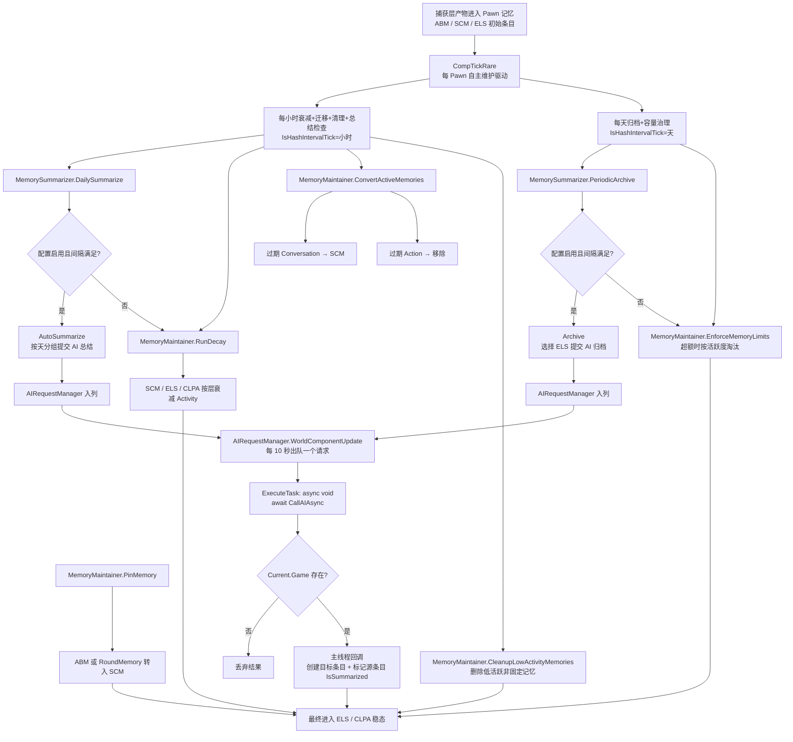

# RimTalk Expand Memory - 维护层结构整理

这份文档只整理当前项目里负责"维护/管理"的那一层，不复述完整采集链和注入链。

这里的"维护层"主要指：

- 记忆活跃度衰减与清理
- 记忆在不同层之间的转移
- 每日总结与长期归档
- AI 总结的异步执行与回写
- 这些行为对应的配置入口

`项目管线.md` 只作为全局参考；下面的结构以当前代码实际职责为准。

## 1. 维护层总览

当前维护层不是一个单独目录，而是由 6 个核心部件协作完成：

1. `Source/Memory/MemoryManager.cs`
   全局 `WorldComponent`，仅负责冷启动缓冲、每小时常识更新，以及持有全局缓存（常识库、对话缓存、提示词缓存）。不再负责总结与归档调度。
2. `Source/Memory/FourLayerMemoryComp.cs`
   单 Pawn 的四层记忆状态所有者，持有四层列表与存档读写，通过 `CompTickRare()` 自主驱动维护节奏，并将总结/归档/机械维护任务下发给协作对象。
3. `Source/Maintenance/MemoryMaintainer.cs`
   绑定单个 `FourLayerMemoryComp` 的机械维护器，集中执行衰减、ABM 寿命迁移、低活跃清理、容量治理、Pin 状态及其直接层级迁移，并提供删除操作。
4. `Source/Maintenance/MemorySummarizer.cs`
   绑定单个 `FourLayerMemoryComp` 的语义总结器，统一每日总结、手动总结、选中总结、选中归档与周期归档。负责源条目选择、分组、提示词构建、AI 请求提交和结果回写。
5. `Source/Memory/AI/IndependentAISummarizer.cs`
   AI 基础设施，负责供应商初始化、配置验证和异步 HTTP 调用。不负责缓存、去重、回调注册或提示词构建。
6. `Source/Memory/AI/AIRequestManager.cs`
   全局 `WorldComponent`，持有 AI 请求队列，以 10 秒间隔逐个提交 LLM 请求，并在回调时阻断已退出游戏的会话。

配套的数据与策略定义主要来自：

- `Source/Memory/MemoryEntry.cs`
- `Source/Memory/MemoryCategory.cs`
- `Source/RimTalkSettings.cs`

## 2. 维护层的职责分层

### 2.1 全局调度层

文件：`Source/Memory/MemoryManager.cs`

这个类曾经是整个维护层的"时钟"和"总控"，但经过重构后职责大幅收窄。`WorldComponentTick()` 每 tick 运行一次，但真正的维护动作按不同节奏触发。

它当前只负责 2 件事：

1. 冷启动缓冲
   `sessionStartTick` 配合 `COLD_START_DELAY = 200`，防止读档刚结束就立刻进入维护流程。
2. 每小时常识更新
   每 `DecayInterval = 2500` ticks 检查一次，更新 Pawn 状态常识（24 小时间隔检查）和清理记录。

注意：每日总结排队、定期归档、手动总结排队均已从 `MemoryManager` 移除。这些工作现在由每个 Pawn 的 `FourLayerMemoryComp.CompTickRare()` 通过 `IsHashIntervalTick` 哈希分散自主执行，`MemoryManager` 不再直接参与总结与归档调度。

`MemoryManager` 还持有全局缓存（`CommonKnowledgeLibrary`、`ConversationCache`、`PromptCache`），这些缓存不属于维护算法本身，但由维护层间接使用。

### 2.2 Pawn 级维护层

文件：

- `Source/Memory/FourLayerMemoryComp.cs`
- `Source/Maintenance/MemoryMaintainer.cs`
- `Source/Maintenance/MemorySummarizer.cs`

这是维护层的实际执行核心。每个 Pawn 各自持有一套四层容器（全部由 `FourLayerMemoryComp` 拥有）：

- `activeMemories`：ABM，超短期
- `situationalMemories`：SCM，短期
- `eventLogMemories`：ELS，中期
- `archiveMemories`：CLPA，长期

`FourLayerMemoryComp` 负责：

- 管理四层列表本身与存档读写
- 通过 `CompTickRare()` 自主驱动维护节奏
  - 每小时（`IsHashIntervalTick(TicksPerHour)`）：总结检查 + 衰减 + ABM 迁移 + 低活跃清理
  - 每天（`IsHashIntervalTick(TicksPerDay)`）：周期归档 + 容量治理
- 持有 `MemoryMaintainer` 和 `MemorySummarizer` 实例并公开属性供外部调用
- 提供检索等查询操作

`MemoryMaintainer`（POCO，每个 Comp 一个实例）负责：

- 按层衰减 `Activity`（ABM 不参与小时衰减）
- ABM 寿命到期自动迁移（`ConvertActiveMemories`，Conversation 迁入 SCM、其余移除）
- 清理低活跃非固定记忆（`CleanupLowActivityMemories`）
- 执行各层容量策略（`EnforceMemoryLimits`，超额时按最低活跃度+最旧时间淘汰）
- 处理 Pin 状态及 Pin 造成的直接层级迁移（`PinMemory`，含 `RoundMemory` 实体化）
- 提供 `Remove` 操作

`MemorySummarizer`（POCO，每个 Comp 一个实例）负责：

- 每日自动总结（`DailySummarize` → `AutoSummarize`）
- 手动总结（`ManualSummarize`）
- 周期自动归档（`PeriodicArchive` → `Archive`）
- 手动归档（`Archive`，与自动归档共用入口）
- 源条目选择、按天分组、提示词构建
- 通过 `AIRequestManager` 提交 AI 请求
- 在主线程回调中创建目标条目并标记源条目

因此，`MemoryManager` 是"全局缓存与冷启动管理器"，`FourLayerMemoryComp` 是"自主维护的状态所有者"，`MemoryMaintainer` 是"单体机械维护引擎"，`MemorySummarizer` 是"语义总结与归档引擎"。

### 2.3 AI 总结执行层

文件：

- `Source/Memory/AI/IndependentAISummarizer.cs`
- `Source/Memory/AI/AIRequestManager.cs`

这部分不决定何时总结，也不决定总结结果写到哪里，而是负责：

- `IndependentAISummarizer`：根据配置初始化供应商与模型，提供 `IsAvailable()` 可用性判断，提供 `CallAIAsync(prompt)` 异步 HTTP 调用。
- `AIRequestManager`：持有 AI 请求队列，以 10 秒实时间隔逐个出队提交，回调中检查 `Current.Game` 是否存在以阻断已退出游戏的会话。

这里的关键设计是：

- `MemorySummarizer` 构建提示词后，通过 `AIRequestManager.EnqueueAIRequest(prompt, callback)` 入列
- `AIRequestManager.WorldComponentUpdate()` 每帧检查队列，按 10 秒间隔出队一个请求
- `ExecuteTask` 是 `async void`，`await CallAIAsync` 后续体通过 Unity 的 `UnitySynchronizationContext` 回到主线程执行
- 回调在主线程中操作 `List<MemoryEntry>` 和字段，无需额外的线程 marshal 机制
- 若游戏已退出（`Current.Game == null`），回调直接返回，不执行任何操作

所以 AI 总结在维护层中扮演的是"异步后处理器"，不是同步生成器。

## 3. 维护层的核心数据模型

### 3.1 层级定义

文件：`Source/Memory/MemoryCategory.cs`

当前项目里的四层定义是：

- `Active`：ABM，超短期
- `Situational`：SCM，短期
- `EventLog`：ELS，中期
- `Archive`：CLPA，长期

记忆类型枚举中，`Observation`（未实现）已被替换为 `Summarization`（总结），用于标记由总结/归档产生的新条目。`Interaction` 已废弃，保留仅为兼容旧存档的 enum 序列值。

### 3.2 单条记忆的维护字段

文件：`Source/Memory/MemoryEntry.cs`

维护层真正依赖的字段主要有：

- `Type`
- `Layer`
- `Importance`
- `Activity`
- `IsPinned`
- `IsUserEdited`
- `IsSummarized`
- `IsSummarizing`（非持久，不写入 Scribe）
- `GameTick`
- `tags` / `keywords`

其中最关键的控制位：

1. `Activity`
   参与衰减、低活跃清理、容量淘汰、检索排序。
2. `IsPinned`
   固定记忆不参与衰减删除，也尽量不参与自动清理。
3. `IsSummarized`
   用于防止同一条记忆被重复纳入总结池。标记后不再被自动总结/归档选中，但手动总结/归档仍可选中。
4. `IsSummarizing`
   临时标识，表示条目正在被总结/归档流程处理中。非持久字段，不写入 Scribe。用于防止同一批次条目被并发选中。
5. `GameTick`
   决定时间排序，也影响"最旧优先归档"和"按时间插入"的行为。

`MemoryEntry.Decay(float rate)` 也很重要：它只做一件事，把 `Activity *= (1f - rate)`，并跳过固定记忆。

注意：旧的 `CanBeSummarized` 属性已移除。总结/归档的筛选条件直接在 `MemorySummarizer` 中通过模式匹配 `IsSummarizing` 和 `IsSummarized` 实现。

## 4. 维护层的主流程

可以把当前维护链理解成下面这条主线：

```text
FourLayerMemoryComp.CompTickRare（每 Pawn 自主驱动）
  -> 每小时（IsHashIntervalTick=小时）:
      -> MemorySummarizer.DailySummarize
          -> AutoSummarize（按天分组提交 AI 总结）
      -> MemoryMaintainer.RunDecay
      -> MemoryMaintainer.ConvertActiveMemories
      -> MemoryMaintainer.CleanupLowActivityMemories
  -> 每天（IsHashIntervalTick=天）:
      -> MemorySummarizer.PeriodicArchive
          -> Archive（选择 ELS 提交 AI 归档）
      -> MemoryMaintainer.EnforceMemoryLimits

UI 选中操作
  -> FourLayerMemoryComp.Summarizer.ManualSummarize / Archive
  -> 与定时任务相同的 Summarizer

AIRequestManager.WorldComponentUpdate
  -> 每 10 秒出队一个请求
  -> ExecuteTask (async void)
  -> CallAIAsync (HTTP 请求)
  -> UnitySynchronizationContext 回到主线程
  -> 回调：创建目标条目 + 标记源条目
```

### 4.1 维护层管线图



这张图对应的核心意思是：

- `FourLayerMemoryComp.CompTickRare()` 负责日常衰减、ABM 迁移、容量治理以及总结/归档的触发，全部通过 `IsHashIntervalTick` 哈希分散
- `MemorySummarizer` 是总结和归档的唯一执行位置
- `MemoryManager` 不再参与总结与归档调度
- AI 总结是挂在总结/归档之后的异步增强步骤
- `MemoryMaintainer.PinMemory` 是一条独立于定时器的人工层级迁移支线

## 5. 衰减控制结构

### 5.1 触发方式

文件：`Source/Memory/FourLayerMemoryComp.cs`

衰减不再是全局集中触发，而是由每个 Pawn 的 `CompTickRare()` 通过 `IsHashIntervalTick` 哈希分散自主执行，避免遍历所有 Pawn 造成的集中性能冲击。

- 每小时（`GenDate.TicksPerHour`）：`RunDecay()` + `ConvertActiveMemories()` + `CleanupLowActivityMemories()` + `DailySummarize()`
- 每天（`GenDate.TicksPerDay`）：`EnforceMemoryLimits()` + `PeriodicArchive()`

### 5.2 单 Pawn 衰减执行

文件：`Source/Maintenance/MemoryMaintainer.cs`

衰减执行由 `MemoryMaintainer` 负责，分四步：

1. 按层衰减（`RunDecay`）
   只衰减 `SCM / ELS / CLPA`，不衰减 `ABM`。
2. ABM 寿命迁移（`ConvertActiveMemories`）
   按 `abmLifespanHours` 判定期满，Conversation 迁入 SCM，其余移除。
3. 清理低活跃记忆（`CleanupLowActivityMemories`）
   删除 `Activity < 0.01f` 的非固定记忆。
4. 执行容量限制（`EnforceMemoryLimits`）
   对超额的 SCM/ELS/CLPA 按最低活跃度 + 最旧时间淘汰非固定条目。

这里有两个实际特征值得单独指出：

1. `ABM` 不参与小时衰减。
   当前 ABM 是"等待总结的原始缓冲"，由 `ConvertActiveMemories` 处理到期寿命。
2. 衰减本身不直接做层级迁移。
   小时衰减只会降低 `Activity`，以及触发删除或裁剪；层级迁移由 `ConvertActiveMemories` 和总结/归档流程单独承担。

### 5.3 衰减参数入口

文件：`Source/RimTalkSettings.cs`

相关设置项：

- `scmDecayRate = 0.01f`
- `elsDecayRate = 0.005f`
- `clpaDecayRate = 0.001f`

这意味着当前维护策略是：越长期的记忆层，衰减越慢。

## 6. 层级转移与类型转变

这一部分是维护层最核心的结构。当前代码里真正发生的，不只是"内容变短"，还包括"层级迁移"和"条目重写"。

### 6.1 ABM -> SCM：两条路径

**路径一：固定操作触发的转移**

文件：`Source/Maintenance/MemoryMaintainer.cs`

`PinMemory()` 中有一条明确规则：

- 如果被固定的记忆当前在 `MemoryLayer.Active`
- 那么它会被直接从 `ActiveMemories` 移入 `SituationalMemories`，`Layer` 改为 `Situational`

**路径二：ABM 寿命到期自动迁移**

文件：`Source/Maintenance/MemoryMaintainer.cs`

`ConvertActiveMemories()` 按 `abmLifespanHours` 判定到期：

- `Conversation` 类型 → `Clone()` 后迁入 SCM
- `Action` 等其他类型 → 直接移除
- `RoundMemory` 先 `Clone()` 为普通 `MemoryEntry` 再迁入

### 6.2 RoundMemory -> SCM：多人对话实体化

文件：`Source/Maintenance/MemoryMaintainer.cs`

`PinMemory()` 和 `ConvertActiveMemories()` 在处理 `RoundMemory` 时的策略一致：

- 不直接保留原 `RoundMemory`
- 而是调用 `RoundMemory.Clone()` 新建一个普通 `MemoryEntry`
- 新条目层级设为 `Situational`
- 原 `RoundMemory` 从 ABM 移除

所以这里发生的是"双重转变"：

1. 层级从对话缓冲进入 SCM
2. 数据结构从 `RoundMemory` 转成普通 `MemoryEntry`

### 6.3 ABM/SCM -> ELS：总结转移

文件：`Source/Maintenance/MemorySummarizer.cs`

`DailySummarize()` / `AutoSummarize()` 的主逻辑：

1. 从 `activeMemories` 和 `situationalMemories` 中收集 `IsSummarizing == false && IsSummarized == false` 且 `GameTick` 落在完整总结周期中的条目
2. 按天分组（`(latestPotentialSummarizeTick - GameTick) / TicksPerDay`），最旧的周期先提交
3. 每组通过 `SummarizeInternal` 提交 AI 请求
4. AI 返回成功后，在主线程回调中创建一个新的 `MemoryType.Summarization` 类型 ELS 条目
5. 将源记忆标记为 `IsSummarized = true`

与旧实现的关键差异：

- **不再清空源条目**：总结后源条目保留在 ABM/SCM 中，仅标记 `IsSummarized = true`。源条目依靠 `ConvertActiveMemories`（ABM 寿命到期）和 `CleanupLowActivityMemories`（低活跃清理）自然消亡。
- **不再生成简单摘要占位**：AI 返回空或失败时，不创建任何 ELS 条目，不产生副作用。源条目的 `IsSummarizing` 标记在 `finally` 中重置，可在下一轮再次参与总结。
- **总结产物类型为 `Summarization`**：不再统一落成 `Conversation`，而是使用独立的 `MemoryType.Summarization`。

从结构上看，这一步是"用新条目替代原阶段内容"，但源条目的消亡是异步且延迟的。

### 6.4 ELS -> CLPA：容量治理 + 周期归档

当前有两种路径把 ELS 推向 CLPA。

第一条：`MemoryMaintainer.EnforceMemoryLimits()`

- 每天执行，ELS 超额时按最低活跃度排序淘汰非固定条目
- 被淘汰的条目直接从 ELS 移除（不再迁入 CLPA）

第二条：`MemorySummarizer.PeriodicArchive()` / `Archive()`

- 选择 ELS 中 `IsSummarizing == false && IsSummarized == false` 的条目（自动归档）
- 或选择传入的 `MemoryType.Summarization` 类型条目（手动归档）
- 提交 AI 请求
- AI 返回成功后，在主线程回调中创建一个新的 `MemoryType.Summarization` 类型 CLPA 条目
- 将源条目标记为 `IsSummarized = true`

与旧实现的关键差异：

- **不再按"前 25%"选择**：自动归档选择所有未总结的 ELS，不再按比例选取。
- **不再清空源条目**：与总结一致，源条目保留在 ELS 中，仅标记 `IsSummarized = true`。
- **不再生成简单归档占位**：AI 失败时不创建任何 CLPA 条目。

所以当前 ELS -> CLPA 不是单一机制，而是：

- 容量裁剪路径：直接淘汰（不再迁入 CLPA）
- 周期归档路径：AI 成功后生成新条目，源条目保留并标记

### 6.5 当前实现下的"类型转变"现状

文件：`Source/Maintenance/MemorySummarizer.cs`

总结和归档产物现在统一使用 `MemoryType.Summarization` 类型：

- 层级上：ABM/SCM -> ELS 和 ELS -> CLPA 是明确发生的
- 类型上：总结和归档产物统一落成 `Summarization` 型

`MemoryFormatter.GetMemoryTypeTag()` 在注入时将 `Summarization` 映射为 `"Summarization"` 字符串，供 LLM 识别。

## 7. 记忆总结结构

### 7.1 每日总结

文件：

- `Source/Memory/FourLayerMemoryComp.cs`
- `Source/Maintenance/MemorySummarizer.cs`

流程是：

1. `CompTickRare()` 每小时通过 `IsHashIntervalTick` 触发 `MemorySummarizer.DailySummarize()`
2. `DailySummarize()` 校验配置项、父组件持有者（须为殖民者，暂行）、总结间隔、上次总结 tick
3. 校验通过后调用 `AutoSummarize()`
4. `AutoSummarize()` 从 ABM + SCM 抓取可总结条目，按天分组，最旧周期先提交
5. 每组通过 `SummarizeInternal()` 构建提示词并入列 `AIRequestManager`

注意：当前不再有 `MemoryManager` 级别的队列和 15 秒间隔逐个处理。每个 Pawn 通过 `CompTickRare` 哈希分散自主触发，天然实现了跨 Pawn 的错峰执行。`AIRequestManager` 的 10 秒请求间隔提供额外的跨 Pawn 限流。

### 7.2 手动总结

文件：

- `Source/Memory/UI/MainTabWindow_Memory_Actions.cs`
- `Source/Maintenance/MemorySummarizer.cs`

手动总结不是另一套算法，而是另一套触发方式：

- UI 收集用户选中的条目 ID，调用 `Summarizer.ManualSummarize(source)`
- `ManualSummarize` 从 ABM + SCM 中抓取 query 命中的条目
- 手动总结权限更高，`IsSummarized` 的条目也可再次总结（仅排除 `IsSummarizing`）
- 最终仍调用 `SummarizeInternal`

"一键总结所有殖民者"（`SummarizeAll`）直接遍历所有 Pawn 调用 `Summarizer.AutoSummarize()`，不再经过 `MemoryManager` 队列。

### 7.3 AI 失败与无副作用设计

文件：`Source/Maintenance/MemorySummarizer.cs`

当前总结采用"AI 成功才创建条目"的模式，与旧的"先落地简单摘要再 AI 覆盖"不同：

1. `SummarizeInternal` 构建提示词和空目标条目（`BuildEmptySummary`），但目标条目 `Content` 为 `null`
2. 将源条目标记 `IsSummarizing = true`
3. 入列 `AIRequestManager`，回调中：
   - AI 返回空/失败 → `Log.Error` + `return`，不创建 ELS/CLPA 条目
   - AI 返回成功 → 设置 `Content`，添加到目标列表，标记源条目 `IsSummarized = true`
4. `finally` 中无论成功失败都重置 `IsSummarizing = false`

设计意图：

- AI 失败时不产生垃圾条目
- 失败的源条目在下一轮总结中可再次参与（`IsSummarized` 未被设置）
- `IsSummarizing` 防止同一批次被并发选中

### 7.4 归档总结

文件：

- `Source/Maintenance/MemorySummarizer.cs`

自动归档时，`PeriodicArchive()` 校验配置和间隔后调用 `Archive()`。

`Archive()` 的手动和自动共用一个入口：

- 显式传入 `source` → 手动归档，面向 `MemoryType.Summarization` 类型
- 未传入 `source` → 自动归档，选择 ELS 中未总结的条目

归档提示词使用 `ArchivePrompt` 模板，不显示 12 小时制时间（`showHour: false`），文本更偏长期画像/里程碑事件。

## 8. AI 总结子系统在维护层中的位置

### 8.1 初始化与可用性判断

文件：`Source/Memory/AI/IndependentAISummarizer.cs`

`IsAvailable()` 会在第一次使用时触发 `Initialize()`。

初始化来源分两种：

- 跟随 RimTalk 的 AI 配置
- 使用本模组独立配置

维护层并不关心底层供应商是 OpenAI、DeepSeek、Google 还是 Player2；它只依赖"AI 当前是否可用"。

### 8.2 请求队列与限流

文件：`Source/Memory/AI/AIRequestManager.cs`

`AIRequestManager` 是 `WorldComponent`，持有实例级请求队列（非静态），以单例模式暴露 `Instance` 供外部入列。

- `EnqueueAIRequest(prompt, callback)`：将请求入列
- `WorldComponentUpdate()`：每帧检查队列，按 10 秒实时间隔出队一个请求
- `ExecuteTask`：`async void`，`await CallAIAsync` 后通过 `UnitySynchronizationContext` 回到主线程
- 回调中检查 `Current.Game == null`，若游戏已退出则丢弃结果

旧的缓存（`completedSummaries`）、去重（`pendingSummaries`）、回调注册（`callbackMap`）和主线程队列（`mainThreadActions`）均已移除。当前无缓存、无去重，每个请求独立提交。

### 8.3 提示词模板

文件：

- `Source/Maintenance/MemorySummarizer.cs`
- `Source/RimTalkSettings.cs`

提示词构建已从 `IndependentAISummarizer` 迁移到 `MemorySummarizer.BuildPrompt()`。

当前两类总结模板：

- 总结（`SummarizePrompt` / `DefaultSummarizePrompt`）：用于 ABM/SCM → ELS
- 归档（`ArchivePrompt` / `DefaultArchivePrompt`）：用于 ELS → CLPA

对应设置项：

- `SummarizePrompt`
- `ArchivePrompt`
- `summaryMaxTokens`

`BuildPrompt` 支持在总结时额外标注 12 小时制时间（`showHour: true`），归档时不标注。模板格式非法时自动降级为默认模板。

## 9. 配置入口结构

文件：`Source/RimTalkSettings.cs`

维护层的主要策略开关都集中在这里。

### 9.1 容量相关

- `maxSituationalMemories`
- `maxEventLogMemories`
- `maxArchiveMemories`

注意：`maxActiveMemories` 仍保留字段，但注释说明它已废弃，ABM 当前视为无容量上限。

### 9.2 衰减与 ABM 寿命相关

- `scmDecayRate`
- `elsDecayRate`
- `clpaDecayRate`
- `abmLifespanHours`（ABM 寿命，以游戏小时计，0 表示禁用）

### 9.3 总结相关

- `EnableDailySummarization`
- `summarizationHour`
- `useAISummarization`
- `maxSummaryLength`

### 9.4 归档相关

- `EnableAutoArchive`
- `ArchiveIntervalDays`
- `maxArchiveMemories`

### 9.5 AI 提示词与模型相关

- `useRimTalkAIConfig`
- `independentApiKey`
- `independentApiUrl`
- `independentModel`
- `independentProvider`
- `SummarizePrompt`
- `ArchivePrompt`
- `summaryMaxTokens`

从职责上看，`RimTalkSettings` 不是维护逻辑本身，但它决定维护层"以什么节奏、什么阈值、什么 AI 策略"来工作。

## 10. 当前维护层的边界

为了避免和 `项目管线.md` 的全局分层混在一起，当前可以把维护层边界明确成下面这样。

### 属于维护层的

- `MemoryManager` 的冷启动缓冲和常识更新
- `FourLayerMemoryComp` 的衰减、清理、层级迁移、总结、归档的驱动
- `MemoryMaintainer` 的机械维护
- `MemorySummarizer` 的总结与归档
- `IndependentAISummarizer` / `AIRequestManager` 的 AI 调用与请求管理
- `MemoryEntry` / `MemoryLayer` / `MemoryType` / 设置项中的维护元数据

### 不属于维护层本体，但会把数据送进来或从这里取走

- 捕获层：`JobMemoryCapturer`、`RoundMemoryManager`、各类 Patch
- 检索/注入层：`UnifiedMemoryInjector`、各类 Collector、评分系统
- UI 层：记忆窗口和手动按钮只是触发维护动作，不承担维护核心逻辑

也就是说，维护层位于"采集之后、注入之前"的中间治理段。

## 11. 当前已知限制

以下是当前实现中有意为之或待后续阶段处理的限制：

1. **声带链接动物暂未覆盖**
   `MemorySummarizer.DailySummarize` 和 `PeriodicArchive` 硬编码 `Parent is Pawn { IsColonist: true }`。旧代码通过 `IsColonyAnimalWithVocalLink` 包含配置了声带链接的动物/机械体，但该逻辑因 Comp 注入时机问题（Hediff 在 Comp 初始化时尚未初始化）无效，目前暂时移除。待 Comp 注入问题解决后可能重启。

2. **`_lastSummarizeTick` 不持久化**
   `MemorySummarizer` 是无持久状态 POCO，`_lastSummarizeTick` 不写入 Scribe。每次读档后通过 `ComputeLatestPotentialSummarizeTick()` 重新计算。当前逻辑通过 `<=` 比较能避免当天重复触发。

3. **`MemoryManager` 残留代码**
   `UpdateEventKnowledgeTimePrefixes()` 和 `IsColonyAnimalWithVocalLink()` 仍在 `MemoryManager` 中但无调用方，标注为"待解耦"，不在本轮重构清理范围内。

4. **`SummarizeAll` 不经 `MemoryManager` 队列**
   "一键总结所有殖民者"直接遍历 Pawn 调用 `AutoSummarize()`，不再有 `MemoryManager` 级队列限流。跨 Pawn 限流由 `AIRequestManager` 的 10 秒请求间隔承担。退出游戏时未完成的请求会随 `AIRequestManager` 实例销毁而消失，未总结完成的条目仍可在下一轮中参与总结。

## 12. 一句话结构图

如果压缩成一句话，当前项目的维护层结构就是：

> `FourLayerMemoryComp.CompTickRare()` 驱动衰减、ABM 寿命迁移、容量治理以及总结/归档的触发，`MemoryMaintainer` 执行具体的机械维护规则，`MemorySummarizer` 统一执行总结与归档并提交 AI 请求，`AIRequestManager` 以 10 秒间隔逐个提交请求并在主线程回调，`IndependentAISummarizer` 只负责 HTTP 调用，`MemoryManager` 退化为全局缓存与冷启动管理器，而 `RimTalkSettings` 提供这整套维护策略的阈值与开关。
