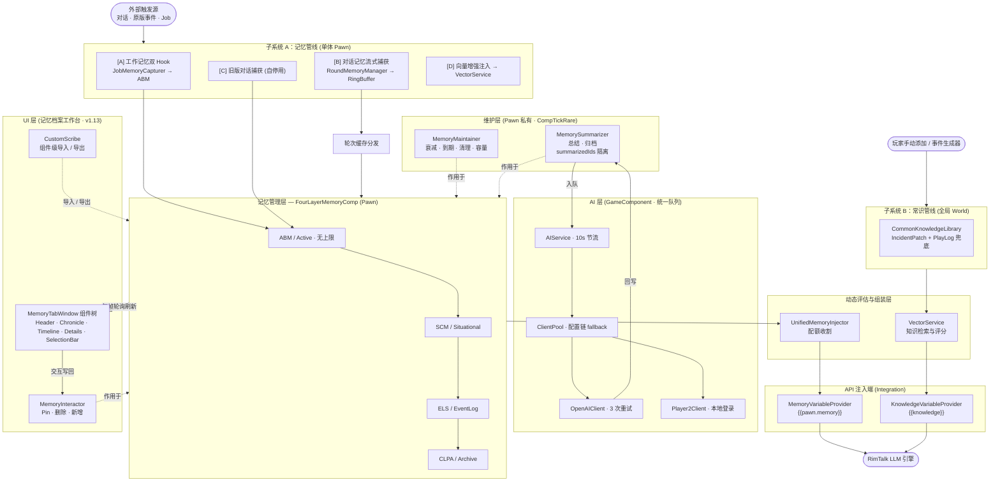

# RimTalk Expand Memory - 项目架构与运作管线

根据实际架构设计，**常识系统（WorldComponent）**、**轮次记忆系统（GameComponent）** 与 **个人记忆系统（ThingComp）** 构成了游戏内部三大不同生命周期层级的基石。它们在各自的生命周期层级独立收集、存储、衰减数据，并最终**在 API 注入端汇聚**。维护层在捕获与注入之间独立承担四层维护与 AI 总结/归档，AI 层经统一队列与多配置 fallback 完成长耗时调用，UI 层（记忆档案工作台）以数据驱动轮询展示四层仓库、交互写回经 `MemoryInteractor` 收口。

## 1. 系统运作管线示意图

> **图例补充**（细节向，便于查图）：
> - **[A] 工作记忆**：`StartJob` Postfix 预提取 + `CleanupCurrentJob` Prefix 生成，3 路聚合（精确合并 / 模糊聚合 / 新会话），v1.10 起仅捕获成功完成的工作。
> - **[B] 流式捕获**：`TalkService.CreateInteraction` / `CustomDialogueService` / RimChat `FinalizeSession`·`RecordDiplomacySummary` 四路入口；`ConditionalWeakTable` 弱引用隔离 session，`RimRingBuffer` 上限 256。
> - **维护层**：均为无持久状态 POCO，由 `FourLayerMemoryComp.CompTickRare` 按哈希分散调度；`MemorySummarizer` 基于 Pawn 私有 `summarizedIds`（OriginId 集合）判断是否已总结，避免一名参与者总结后阻塞其他参与者分别总结。Pin/删除已于 v1.13 迁移至 `MemoryInteractor`。
> - **AI 层**：`OpenAIClient` 基于 `UnityWebRequest` 走统一 `chat/completions`，重试间隔 4s/8s，429/5xx 可重试，401/403 与致命 4xx 立即失败；`Player2Client`（v1.12 起为默认 provider）经本地端口发现与登录自行鉴权，免填 Key/模型/URL；配置来源 `RimTalkApiConfigGetter` 跟随 RimTalk 时映射 `CloudConfigs` 或简单配置，独立模式用 `Settings.ApiConfigs`，单次失败自动 fallback 至下一配置。详见 `AI层.md`。
> - **UI 层 (v1.13)**：主标签 `MemoryTabWindowBridge` 桥接自制 `UIElement` 组件树（详见 `UI层.md` 与 `UI层基础设施和规范.md`）；`MemoryInteractor` 收口 Pin（含 ABM→SCM 迁移与 RoundMemory 实体化）/删除/新增；`CustomScribe` 以整个 `FourLayerMemoryComp` 为单位导入导出；Harmony 短路 `MainTabsRoot.HandleLowPriorityShortcuts` 左键分支，地图选人时主标签保持打开并自动切换记忆所有者。
> - **四层流转**：ABM 寿命到期 → SCM，SCM 衰减 → ELS，ELS 低活跃 / 容量裁剪 → CLPA。
> - **组装层**：`UnifiedMemoryInjector` 内部经 `PromptNormalizer` / `MemoryFormatter` / `SuperKeywordEngine` / `KeywordExtractionHelper` 与 `VectorService` 协同完成匹配与评分。

---

## 2. 核心中的核心：三大维度的数据基石

除了我们前面提到的 **`MemoryManager` (WorldComponent 记忆管理器)**、**`FourLayerMemoryComp` (ThingComp 四层组件)** 以及 **`MemoryEntry` (记忆条目)** 之外，系统中还存在与它们**完全同级**的几大核心类，它们共同支撑起了游戏的三个维度（全局世界、当前存档、单体角色），并由 v1.10 新增的**维护层**/**AI 层**与 v1.13 新增的 **UI 交互层**分别承担机械维护、长时调用与用户交互：

### 🥇 维度 1：Game 级别 (贯穿整个当前存档)
应对超高频的对话流，需要一个不依赖具体某个小人的中枢。
*   **`RoundMemoryManager` (GameComponent)**:
    *   **同级地位**：与 `MemoryManager` 级别等同，但它挂载在 `Game` 上。它负责全局的"轮次对话中控台"，使用 `RimRingBuffer` 维护一个高效定长队列。在玩家读档后，它会主动去遍历所有小人，做一次惊人的"狸猫换太子"（指针替换），使得一场群体对话无论涉及多少个小人，在内存里只占用一份 `RoundMemory` 实例，大幅缩减存档体积。
    *   **流式捕获**：通过 `TalkService.CreateInteraction` Hook，每句 pawn 说出口的对话实时追加到对应 session 的 `RoundMemory`。使用 `ConditionalWeakTable` 以弱引用隔离不同会话，TalkRequest 被 GC 后条目自动回收，无需手动清理。
*   **`RoundMemory`**:
    *   **同级地位**：继承自 `MemoryEntry` 的特化数据类。普通的 `MemoryEntry` 是单人的回忆，而 `RoundMemory` 带有 `HashSet<Pawn> Pawns`（参会人员）和 `AbsTick`（绝对游戏时间），代表"大家共同经历的同一场对话"。
    *   **流式追加**：新增 `AppendLine()` 方法，支持在构造后逐行追加发言内容；构造器支持 null content，配合 AppendLine 实现零冗余空行。
    *   **私有化（v1.10）**：`Clone()` 改写为 `override Privatize()`，创建扁平副本并设置 `OriginId` 追踪原始出处，供 `MemorySummarizer` 识别总结来源；`MemoryEntry` 新增 `virtual Privatize()`（基类默认返回自身）与 `OriginId` 属性。
*   **`AIService` (GameComponent) —— v1.10 新增**:
    *   **同级地位**：彻底重写后的 AI 编排层，挂载在 `Game` 上。以 10s 现实时间节流的统一队列调度所有总结/归档请求，`EnqueueAIRequest(prompt, callback, dispose)` 入队，`Payload.IsValid` 校验通过后回调，`finally` 执行 `dispose`。
    *   **配置 fallback**：通过持有的 `ClientPool` 与 `AIClientFactory` 按配置链懒构建客户端（OpenAI 兼容端点的 `OpenAIClient`，或 v1.12 起为默认 provider 的 `Player2Client`，后者经本地端口发现与登录自行鉴权），单次请求失败自动 fallback 至下一有效配置；`OpenAIClient` 基于 `UnityWebRequest` 走统一 `chat/completions`，客户端内最多 3 次重试（429/5xx 可重试，401/403 与致命 4xx 立即失败）。
    *   **配置来源**：`RimTalkApiConfigGetter` 跟随 RimTalk 时映射 `CloudConfigs`（或简单配置模式）为深拷贝，独立模式使用 `Settings.ApiConfigs`。

### 🥇 维度 2：World 级别 (贯穿世界的背景与常识)
*   **`MemoryManager` (WorldComponent)**:
    *   **同级地位**：全局心跳控制器，持 `CommonKnowledgeLibrary` 与 `PromptCache`。v1.10 后不再调度个人记忆衰减/总结/归档，仅做冷启动延迟、每小时常识维护、`PawnStatusKnowledgeGenerator` 调度等。
*   **`CommonKnowledgeLibrary`**:
    *   **同级地位**：它是与 `FourLayerMemoryComp` (四层容器) 对标的常识大总管。存储了世界上所有不随单个小人改变而改变的规则与设定。
*   **`CommonKnowledgeEntry`**:
    *   **同级地位**：与 `MemoryEntry` 同级的数据模型。带有 `KnowledgeEntryCategory` (类别) 和 `KeywordMatchMode` (匹配模式)，用来告诉系统这段背景故事该在什么时候被 LLM 唤起。

### 🥇 维度 3：Pawn 级别 (绑定在单个角色的肉体上)
*   **`FourLayerMemoryComp` (ThingComp)**:
    *   **同级地位**：单体记忆的调度和控制中枢。持四层列表（ABM/SCM/ELS/CLPA），并新增 Pawn 私有的 `summarizedIds`（已总结记忆的 `OriginId` 集合）与 `summarizedIdsInitialized` 标记，使长期总结状态按 Pawn 隔离并由主组件统一持久化；保存前与现存 `OriginId` 求交集清理；旧存档首次加载将历史 ABM/SCM/ELS 一次性迁移为已总结状态。v1.13 实现 `IExposable`（`ExposeData` 转发 `PostExposeData`，正常存档路径仍只走 `PostExposeData`）以支持组件级导入导出，并新增 `Import()` 整体替换四层内容。
    *   **内部模块**：持 `JobMemoryCapturer`（POCO）与 v1.10 抽出的 `MemoryMaintainer`、`MemorySummarizer` 及 v1.13 抽出的 `MemoryInteractor`（均为无持久状态 POCO）。
*   **`JobMemoryCapturer` (POCO)**:
    *   **同级地位**：负责工作记忆的双 Hook 捕获（`StartJob` Postfix 预提取 + `CleanupCurrentJob` Prefix 生成），记忆记录的是"已发生的工作"而非"已下达的意图"，**仅捕获成功完成的工作**（v1.10），产物直入 ABM。
*   **`MemoryMaintainer` (POCO，v1.10 抽取)**:
    *   **同级地位**：记忆的机械维护器，承担 Activity 衰减（SCM/ELS/CLPA）、ABM 寿命到期自动迁移、低活跃清理、容量裁剪（Pin/删除已于 v1.13 迁移至 `MemoryInteractor`）。无持久状态，由 Comp 按哈希分散调度。
*   **`MemorySummarizer` (POCO，v1.10 抽取/重写)**:
    *   **同级地位**：统一并重构总结与归档调度（每日、手动、选中、周期），v1.13 新增静态 `SummarizeAll()` 全局总结入口。AI 回写失败时不修改源记忆、可下一轮重试；成功后直接写入 ELS/CLPA；总结/归档后的源条目依靠 ABM 寿命迁移自然消亡。无持久状态，由 Comp 按哈希分散调度。
*   **`MemoryInteractor` (POCO，v1.13 抽取)**:
    *   **同级地位**：记忆仓库交互器，向 UI 层提供统一写入口：`PinMemory`（自动处理 ABM→SCM 迁移与 `RoundMemory` 实体化）、`RemoveMemory`（跨层删除同一引用）、`AddMemory`（按层级入列）。无持久状态，由 Comp 构造持有。
*   **`MemoryEntry`**:
    *   **同级地位**：个体的单条记忆承载单元。v1.10 将 ID 由 Guid 字符串改为加密随机数生成的正 `long`，读档兼容旧版 `mem-` 前缀十六进制 ID；`OriginId` 同步调整为 long。v1.12 引入 `EndGameTick` 表示 CLPA 区间结束时间戳（旧存档按默认跨度 15 天回填）；v1.13 字段规范化（`tags`→`Tags`、`Notes`→`Note`、`Activity` setter 收束至 [0,1]），序列化键不变。

---

## 3. 全项目文件归属模块清单 (按独立系统划分)

### 📌 A. 个人记忆系统 (Memory System) - 挂载于个体 (Pawn)
*   **拦截与捕获**:
    *   `Source/Patches/Capture/JobMemoryCapturer_Patches.cs` (工作记忆双 Hook: StartJob Postfix + CleanupCurrentJob Prefix)
    *   `Source/Capture/JobMemoryCapturer.cs` (工作记忆捕获 POCO, 3 路聚合管线: 精确合并/模糊聚合/新会话; v1.10 仅捕获成功完成的工作, 用 GenTicks 取 Tick)
    *   `Source/Patches/Capture/RimTalkConversationCapturePatch.cs` (旧版对话捕获, RoundMemory 激活时自停用)
*   **模型与存储 (核心基石)**:
    *   `Source/Memory/FourLayerMemoryComp.cs` (单人容器 + Pawn 私有 `summarizedIds` 持久化)
    *   `Source/Memory/MemoryEntry.cs` (`MemoryEntry`, `MemoryLayer`, v1.10 ID 改 long, 新增 `Privatize()` 与 `OriginId`)
    *   `Source/Memory/MemoryCategory.cs`
    *   `Source/Memory/PawnMemoryComp.cs`
*   **处理与收集 (Collectors)**:
    *   `Source/Memory/Injection/ABMCollector.cs`, `ELSCollector.cs`
    *   `Source/Memory/Injection/MemoryFormatter.cs` (v1.10 注入文本格式化)
*   **动态评分与调度**:
    *   `Source/Memory/Injection/UnifiedMemoryInjector.cs`
    *   `Source/Memory/DynamicMemoryInjection.cs`
    *   `Source/Memory/SemanticScoringSystem.cs`, `AdvancedScoringSystem.cs`, `SceneAnalyzer.cs`

### 📌 B. 轮次对话系统 (Round Memory) - 挂载于当前存档 (Game)
*   **捕获 (Capture)**:
    *   `Source/Patches/Capture/TalkService_CreateInteraction_Patch.cs` (流式管线: CreateInteraction Hook → StreamingBuildRoundMemory)
    *   `Source/Patches/Capture/CustomDialogueService_ExecuteDialogue_Patch.cs` (捕获玩家发言 → CapturePlayerDialogue)
    *   `Source/Patches/PromptContext_FromTalkRequest_Patch.cs` (填充 TalkRequest.Participants)
    *   `Source/Patches/Injection/RoundMemoryManager_ResetDuplicateCache_Patch.cs` (重置去重缓存)
    *   `Source/Patches/RimChat/RpgNpcDialogueArchiveManager_FinalizeSession_Patch.cs` (RPG对话 → BuildRoundMemory 批量)
    *   `Source/Patches/RimChat/RpgNpcDialogueArchiveManager_RecordDiplomacySummary_Patch.cs` (外交对话 → BuildRoundMemory 批量)
*   **模型与存储 (核心基石)**:
    *   `Source/Memory/RoundMemory/RoundMemoryManager.cs` (游戏全局缓冲池 + 流式 session 管理)
    *   `Source/Memory/RoundMemory/RoundMemory.cs` (特化型多人群聊记忆模型 + AppendLine; v1.10 `Privatize()` 创建扁平副本并设 `OriginId`)
    *   `Source/Utils/RimRingBuffer.cs`

### 📌 C. 常识世界系统 (Knowledge System) - 挂载于世界 (World)
*   **捕获与生成** (v1.10 目录迁移至 `Source/CommonKnowledge/`):
    *   `Source/Patches/IncidentPatch.cs` (事件拦截: IncidentWorker.TryExecute Postfix, 重要性 ≥ 0.5 写入常识库, 袭击两阶段追踪)
    *   `Source/CommonKnowledge/EventRecordKnowledgeGenerator.cs` (PlayLog 扫描, 每小时读取非 Incident 事件兜底补充)
    *   `Source/CommonKnowledge/PawnStatusKnowledgeGenerator.cs`
*   **模型与管理 (核心基石)**:
    *   `Source/Memory/MemoryManager.cs` (世界全局载体, v1.10 后仅做常识维护/调度, 不再调度个人记忆)
    *   `Source/CommonKnowledge/CommonKnowledgeLibrary.cs` (常识规则容器)
    *   `Source/CommonKnowledge/CommonKnowledgeAPI.cs`, `CommonKnowledgeEntryExtensions.cs`
    *   `Source/CommonKnowledge/KnowledgeTypes.cs` (包含 `CommonKnowledgeEntry`)
    *   `Source/CommonKnowledge/ExtendedKnowledgeEntry.cs`
    *   `Source/CommonKnowledge/KeywordExtractionHelper.cs`, `SuperKeywordEngine.cs`
*   **向量搜索支持** (v1.10 目录迁移至 `Source/VectorDB/`):
    *   `Source/VectorDB/VectorService.cs`
    *   `Source/VectorDB/InMemoryVectorStore.cs`
    *   `Source/VectorDB/EmbeddingService.cs`

### 📌 D. 维护层 (Maintenance Layer) - v1.10 抽取, 每 Pawn 私有
*   **核心组件** (目录 `Source/Maintenance/`):
    *   `Source/Maintenance/MemoryMaintainer.cs` (机械维护器: Activity 衰减、ABM 到期、低活跃清理、容量裁剪; v1.13 起 Pin/删除迁至 MemoryInteractor)
    *   `Source/Maintenance/MemorySummarizer.cs` (语义总结器: 每日/手动/选中/周期总结与归档, AI 回写; v1.13 新增静态 `SummarizeAll` 全局总结入口)
    *   `Source/Maintenance/MemoryInteractor.cs` (UI 交互器: Pin 含 ABM→SCM 迁移、跨层删除、按层级新增)

### 📌 E. AI 层 (AI Layer) - v1.10 彻底重写, 每 GameComponent
*   **服务编排** (目录 `Source/AI/`):
    *   `Source/AI/AIService.cs` (GameComponent, 10s 节流队列, Payload.IsValid 校验后回调)
    *   `Source/AI/AIClientFactory.cs` (按配置链懒构建客户端: Player2 provider 专用 Player2Client, 其余走 OpenAIClient)
    *   `Source/AI/AIProvider.cs`, `Source/AI/ApiConfig.cs`, `Source/AI/Payload.cs`
*   **客户端实现** (目录 `Source/AI/Client/`):
    *   `Source/AI/Client/ClientPool.cs` (配置链 + fallback)
    *   `Source/AI/Client/OpenAIClient.cs` (UnityWebRequest, 统一 chat/completions, 3 次重试)
    *   `Source/AI/Client/Player2Client.cs` (v1.12: Player2 本地客户端, api.port 端口发现 + /login/web 登录 + 专用请求头, 不发送 model 字段)
    *   `Source/AI/Client/IAIClient.cs`
    *   `Source/AI/Client/Dto/OpenAIRequest.cs`, `OpenAIResponse.cs`, `Player2Request.cs`, `Player2LoginResponse.cs`
*   **与 RimTalk 集成**:
    *   `Source/AI/Integration/RimTalkApiConfigsGetter.cs` (跟随 RimTalk 时映射 CloudConfigs/简单配置 深拷贝)
*   **设置接入**:
    *   `Source/RimTalkSettings.cs` (v1.10 新增 `UseRimTalkAIConfig`、`EnableAILog`、`ApiConfigs` 多备选配置; v1.12 起 Player2 为默认 provider)

### 📌 F. API 注入与集成 (API Integration) - 向外输出
*   **拦截与增强**:
    *   `Source/Patches/Patch_GenerateAndProcessTalkAsync.cs` (向量增强注入: Prefix Hook → VectorService.FindBestLoreIdsAsync, 注入相关 Lore 到 PromptMessages)
*   **接口注册**:
    *   `Source/API/RimTalkAPIIntegration.cs` (反射向模板引擎注册变量)
    *   `Source/API/MustacheVariableHelper.cs`
*   **数据提供者 (Providers)**:
    *   `Source/API/MemoryVariableProvider.cs` (暴露 `{{pawn.memory}}`, 内部调用 `UnifiedMemoryInjector`)
    *   `Source/API/KnowledgeVariableProvider.cs` (暴露 `{{knowledge}}`, 内部调用 `CommonKnowledgeLibrary`)

### 🛠️ G. 通用基础设施 (Shared)
*   **文本清理与缓存**:
    *   `Source/Memory/PromptNormalizer.cs`
    *   `Source/Memory/PromptCache.cs`
*   **通用工具** (目录 `Source/Utils/`):
    *   `Source/Utils/JsonUtil.cs`, `Source/Utils/MessageUtil.cs`, `Source/Utils/RimRingBuffer.cs`, `Source/Utils/GenDateUtil.cs`
    *   `Source/Utils/MathUtil.cs` (v1.13: nice 刻度步长与刻度序列生成), `Source/Utils/WidgetsUtil.cs` (v1.13: 圆形按钮/渐变线/虚线), `Source/Utils/TextUtil.cs` (v1.13: 枚举本地化扩展)
    *   `Source/Utils/GUIBlock.cs` / `Source/Utils/CropBlock.cs` (v1.13: GUI 状态与裁剪作用域), `Source/Utils/EnumUtil.cs`, `Source/Utils/DictionaryExtensions.cs`
*   **设置界面**:
    *   `Source/Settings/SettingsUIDrawers.cs` (v1.10 新增多备选 API 配置 UI 与实时校验; v1.12 Player2 行免填 Key/模型/URL)

### 🖥️ H. UI 层 (UI Layer) - v1.13 记忆档案工作台重写
*   **自制组件树框架** (目录 `Source/UI/`, 详见 `UI层.md` 与 `UI层基础设施和规范.md`):
    *   `Source/UI/UIElement.cs` (组件树基础元素: Pulse 脉动 / UpdateRect 布局传播 / PostClose 生命周期)
    *   `Source/UI/UIContext.cs` (级联作用域上下文: 父链查找 / 事件聚合 / 每帧收束)
    *   `Source/UI/ScrollUIElement.cs` (滚动视口元素)
*   **记忆档案工作台** (目录 `Source/UI/TabWindow/`):
    *   `Source/UI/TabWindow/MemoryTabWindowBridge.cs` (MainTabWindow 桥接层, 唯一的 RimWorld Window)
    *   `Source/UI/TabWindow/MemoryTabWindow.cs` (组件树根 + 局部共享 Context: 记忆组件 / 光标 / 过滤 / 焦点 / 选中 / 事件)
    *   `Source/UI/TabWindow/MemoryCard.cs` (卡片基类: 层级配色 / Pin / 选中脉冲边框)
    *   `Source/UI/TabWindow/MemoryDetails.cs` (详情查看与无缝编辑)
    *   `Source/UI/TabWindow/MemorySelectionBar.cs` (批量动作栏: 总结 / 归档 / 删除 / 清空)
    *   `Source/UI/TabWindow/TabHeader/MemoryTabHeader.cs`, `MemoryTabPawnSelector.cs`, `MemoryCreateDialog.cs` (头部工具栏 / Pawn 搜索选择器 / 新建记忆表单)
    *   `Source/UI/TabWindow/Chronicle/MemoryChronicle.cs`, `ChronicleAxis.cs`, `ChronicleCard.cs`, `ChronicleCardPainter.cs`, `ChronicleCursor.cs` (CLPA 横向篇章导航: 缩放 / 平移 / 光标联动 / 重叠堆叠)
    *   `Source/UI/TabWindow/Timeline/MemoryTimeline.cs`, `TimelineCard.cs` (纵向时间轴: 虚拟化列表 / 年象分隔 / 长短期间隔标注)
*   **导入导出与主标签补丁**:
    *   `Source/CustomScribe.cs` (组件级记忆导出 / 导入, 以整个 FourLayerMemoryComp 为单位)
    *   `Source/Patches/UI/MainTabsRoot_HandleLowPriorityShortcuts_Patch.cs` (地图选人时主标签保持打开并自动切换所有者)
*   **遗留窗口** (目录 `Source/Memory/UI/`):
    *   `Source/Memory/UI/ITab_Memory.cs`, `VirtualListView.cs`
    *   `Source/Memory/UI/Dialog_CommonKnowledge.cs`, `Dialog_InjectionPreview.cs`, `Dialog_PromptEditor.cs`, `Dialog_TagTest.cs`, `Dialog_TextInput.cs`
    *   `Source/Memory/UI/CommonKnowledgeTranslationKeys.cs`, `CommonKnowledgeUIHelpers.cs`
